# Progression — refonte premium applicative

## Phase 2A — fondations UI et isolation CSS

Date : 5 octobre 2026. Branche : `refactor/premium-app-experience`.
Base auditée : `9a5857b` (`docs: complete premium app UX UI audit`).

**État : lot 2A validé par l’utilisateur ; checkpoint local autorisé. Aucun push ni déploiement.**
Les cinq écrans métier ont été ouverts avec le code local et le compte test connecté par l’utilisateur. Aucune régression attribuable au lot 2A n’a été identifiée dans les contrôles décrits ci-dessous. Ce résultat ne vaut pas validation exhaustive de tous les parcours métier.

### Fichiers du lot

| Fichier | Rôle |
|---|---|
| `.gitignore` | Règle ciblée `/.env.local` : configuration locale exclue de Git |
| `src/ncrUi2026.css` | Scope des tokens/body, tokens de contrôles, focus, tailles tactiles, états disabled/pressed et couverture du dialogue partagé |
| `src/ncrUi2026LegacySurfaces.css` | Héritage public/autonome figé depuis la version auditée, sans règles de layout métier |
| `src/ncrUi2026Pages.css` | Trois couleurs de fond de feedback remplacées par leurs tokens équivalents |
| `src/main.tsx` | Import de compatibilité juste avant le socle ; ordre relatif des 51 feuilles existantes inchangé |
| `scripts/generate-public-showcase-css.mjs` | Protection de la baseline CSS héritée lors du build ; régénération désormais explicite |
| `scripts/ui-foundations.test.mjs` | Cinq tests sur les sorties publiques et le refus des dérives non validées |
| `docs/premium-redesign/07_PROGRESS.md` | Compte rendu et limites de validation |

### Isolation retenue

Le socle global est activé par `html[data-ncr-ui-2026="true"]:where(:has(.app-shell))`. Il dépend du shell effectivement monté, pas d’une liste de routes ni de l’état d’authentification. Cela évite un effet React tardif ou un MutationObserver supplémentaire. Le wrapper `:where` n’augmente pas la spécificité des sélecteurs racines.

Les règles de composants déjà sous `.app-shell` conservent leur scope. Aucun nom de classe, ordre des enfants du shell, route ou point d’injection Beauty n’est modifié. Les tokens restent sur `html` lorsque le shell existe : un portail attaché à `body`, y compris hors `#root`, continue à hériter des couleurs, de la police et des surfaces. Le dialogue réel de `ConfirmDialogProvider`, frère du contenu applicatif, rejoint les règles communes des boutons/champs/focus via `.ncr-confirm-dialog`.

En l’absence d’AppShell, `ncrUi2026LegacySurfaces.css` conserve exactement les anciennes déclarations globales de tokens, ponts de couleurs métier et body, y compris OKLCH et le fond mobile. Cette petite duplication est volontaire : la vitrine, les pages d’authentification et les portails autonomes ne doivent plus hériter des futures évolutions du socle applicatif. Ce fichier est une baseline de compatibilité, pas un second design system à faire évoluer en parallèle.

Le changement est progressif : il ne prétend pas isoler les 51 feuilles historiques ni l’intégralité de `styles.css`. Les futurs lots doivent rester sous leur racine de composant/app et vérifier les feuilles métier concernées. Les portails autonomes sans AppShell conservent leur ancien rendu ; leur modernisation est différée.

### Cascade réelle et génération publique

Ordre conservé : feuilles publiques liées dans `index.html`, puis compatibilité figée et NCR UI 2026, puis couches pages/Formation/transversales, puis métiers/Beauty et correctifs mobiles. Aucun passage en CSS layers, aucun framework, aucune fusion massive.

Un premier build a révélé une dérive préexistante entre `src/styles.css` et les deux fichiers CSS servis dans `public/` : la régénération ajoutait environ 1 060 lignes et modifiait des variables globales. Les deux sorties ont été remises exactement à leur contenu du checkpoint, puis protégées par empreintes SHA-256, ainsi que leur source historique.

Désormais le build ordinaire vérifie cette baseline et ne la réécrit pas. Une modification de l’un des trois fichiers fait échouer la génération avec une explication. Une migration volontaire du CSS historique demande `node scripts/generate-public-showcase-css.mjs --refresh-legacy`, une comparaison visuelle publique et une actualisation explicite des empreintes après validation. Cette option n’a été exercée que dans des copies temporaires pour les tests. Ce mécanisme protège les sorties héritées ; il n’empêche pas une nouvelle feuille mal scopée de contaminer la vitrine, d’où la nécessité de la comparaison visuelle.

### Tokens et composants

- Couleurs, surfaces, espaces, rayons et ombres existants conservés ; pas de nouvelle palette.
- Ajout de tokens pour famille typographique, tailles control/compact/caption, interlignes, bordure, rayon pill, focus, opacité disabled et déplacement pressed.
- Fonds success/warning/danger : mêmes mélanges à 5 % qu’auparavant, maintenant nommés et réutilisés par les messages.
- Boutons et champs principaux : hauteur existante de 44 px conservée. Contrôles compacts/icônes : minimum de 44 px sur petit écran ou pointeur grossier ; aucune règle de taille ajoutée aux cartes de rendez-vous.
- Champs de formulaire : 16 px minimum sur mobile/pointeur grossier pour préparer la lisibilité et éviter le zoom de saisie. Vérification sur appareil iOS réel non effectuée.
- Focus visible : couleur forte du métier au lieu d’un mélange éclairci ; règle harmonisée avec la spécificité des champs. Disabled à 0,6, sans transformation/ombre d’action ; `aria-disabled` reçoit un traitement visuel, sans modification des handlers métier.
- Pressed pour boutons secondaires/danger/icônes ; transitions courtes existantes conservées.
- Reduced motion : protection étendue au document applicatif pour couvrir les portails hors shell. Les safe areas existantes restent intactes, et les boutons de confirmation mobile conservent au moins 46 px.

### Vérifications effectuées

| Vérification | Résultat |
|---|---|
| Diff et branche | Aucun changement de page métier, contexte, route, logique métier ou Supabase |
| `git diff --check` | Réussi |
| `node --check` sur les deux scripts du lot | Réussi |
| `node --test scripts/ui-foundations.test.mjs` | 5 tests réussis : conservation, refus de dérive source/de chacune des deux sorties, régénération explicite dans copie temporaire |
| Audits statiques inclus dans `npm run build` | Audit phase 1, parcours critiques et préparation release réussis |
| TypeScript / build production | `npm run build` réussi : `tsc -b`, Vite et génération SEO. Avertissement de taille du bundle (3 778 kB JS), sans erreur bloquante. Les deux CSS publics de dist sont identiques au checkpoint audité |
| Lint | Aucun script/configuration lint fourni dans package.json ; aucune dépendance lint ajoutée |
| Landing locale avant/après | Captures aux cinq largeurs ; mêmes couleurs/polices des titres et liens et même fond/police body. Aucun débordement horizontal global mesuré |
| Composants communs | Banc temporaire sans Auth/Supabase, avec les feuilles dans l’ordre réel et le vrai ConfirmDialogProvider |
| Responsive du banc | 360, 390, 430, environ 768 et 1440 px ; boutons/icônes mobiles proches de 44 px, champs 16 px ; pas de débordement document observé |
| Dialogue hors shell | Ouverture, saisie, confirmation et Échap réussis ; bottom sheet mobile et dialogue centré desktop ; héritage conservé |
| Portail attaché à body | Toast de test visible et héritage correct ; montage/retrait du shell fait apparaître/disparaître les nouveaux tokens applicatifs |
| Thèmes | Formation, Coiffure, Sécurité, Nettoyage, Restauration : accents vérifiés dans le banc, succès/danger constants |
| Clavier | Focus visible mesuré sur icône et textarea du dialogue |
| Portail Formation autonome | Écran de connexion réellement ouvert aux cinq dimensions (360/389/430/767/1439 px mesurés), sans débordement global ; aucune authentification effectuée |

### Validation connectée locale

[VÉRIFIÉ VISUELLEMENT] Tests réalisés dans le navigateur intégré sur `http://localhost:5173`, avec le compte test et ses cinq entreprises. Les largeurs CSS réellement mesurées sont 360, 389, 430, 767 et 1439 px (cibles 360/390/430/768/1440). Les 25 captures ont été inspectées ; aucune largeur de document supérieure au viewport n’a été mesurée. Cela ne supprime pas les scrolls internes prévus par les agendas/listes.

| Écran | Contrôles ciblés effectués |
|---|---|
| Rendez-vous Beauty | Rendez-vous de l’audit présents ; header, KPI, navigation et disposition aux cinq formats. Ouverture/fermeture du formulaire sans sauvegarde, recherche client, champ à 16 px et hauteur proche de 44 px avec focus visible. Menu Beauty injecté et sélecteur de compte ouverts sur mobile |
| Dashboard Formation | Chargement puis dashboard réel ; cinq formats ; passage de 90 à 30 jours et synchronisation du sélecteur. Le double contrôle de période mobile préexistant reste visible |
| Planning Sécurité | Cinq formats, semaine vide et sites existants ; ouverture et fermeture du formulaire de mission sur mobile, sans soumission |
| Planning Nettoyage | Cinq formats ; vues semaine/mois/jour accessibles. Planifier désactivé avec explication : aucun agent actif. Création d’intervention non testée |
| Commandes Restauration | Cinq formats ; commande existante en cours. Recherche sans résultat puis effacement ; filtre Boissons puis retour Tout. Aucun ajout, envoi en cuisine ni encaissement |

Les accents métier et les navigations desktop/mobile restent présents dans les cinq espaces. Le sélecteur d’entreprise fonctionne et reste utilisable en panneau mobile. Les formulaires Beauty/Sécurité ont été fermés sans sauvegarde. Aucune donnée métier n’a été créée, modifiée ou supprimée pendant cette validation ; seuls les filtres et la navigation ont changé. Aucun accès direct à Supabase : uniquement les échanges normaux de l’application connectée.

La densité, les petits textes métier, les longs héros mobiles et les libellés de navigation tronqués (notamment Planning équipe à 360 px) restent des sujets pour les lots suivants. La validation 2A porte sur les fondations et leur compatibilité, pas sur une refonte de ces écrans.

### Limites et éléments laissés pour plus tard

- Aucun P1 métier corrigé : Beauty « Terminer », création Sécurité et autres anomalies de l’audit restent la baseline. Aucun agenda/dashboard refondu.
- Pas de consolidation massive des correctifs Beauty ; les overrides ultérieurs peuvent encore primer sur certains contrôles métier. Les dimensions mesurées sur le banc ne sont pas une garantie pour chaque contrôle du produit.
- Les cinq thèmes ont été exercés sur le banc et les cinq organisations test ouvertes avec le code local. Les variantes personnalisées du moteur de marque blanche ne sont pas exhaustivement testées.
- Le mode du socle est explicitement clair (`color-scheme: light`) ; aucun mode sombre n’a été ajouté. Reduced motion vérifié dans la règle source, pas par bascule du réglage système.
- PWA installée, clavier virtuel, safe areas sur appareil réel, tous les toasts et overlays spécifiques métier, lecteurs d’écran et contrastes WCAG exhaustifs : non vérifiés.
- `:has()` requiert un navigateur moderne ; le projet l’utilise déjà. Pas de validation sur les anciens WebView.
- Les cartes animées de la landing ne sont pas comparables pixel à pixel à deux instants différents ; la comparaison porte sur rendu, typographie, couleurs et géométrie stable. Quelques positions de sections animées évoluent selon leur état d’apparition.
- `.env.local` a été créé par l’utilisateur. Son contenu n’a pas été lu ni affiché par l’agent. Il n’était initialement pas ignoré : ajout de `/.env.local` dans `.gitignore`, puis vérification par `git check-ignore -v` et confirmation qu’il n’est pas suivi. Le serveur a été relancé et l’utilisateur a connecté lui-même son compte test.

### Preuves locales

Captures temporaires : `/tmp/ncr-phase2a/` (`landing-before-*`, `landing-after-*`, `controls-*`, `dialog-*`, `theme-*`, `live-beauty-*`, `live-formation-*`, `live-security-*`, `live-cleaning-*`, `live-restaurant-*`, `live-account-360.jpg`). Mesures de landing dans `landing-before.json` / `landing-after.json`, matrice connectée dans `live-validation.json`. Logs de build : `/tmp/ncr-phase2a-build.log`. Les exports du navigateur peuvent être redimensionnés/flous : ce n’est pas un défaut typographique établi de l’application.

Le banc est un outil temporaire de vérification, pas une route de production ni un contournement des permissions. Ses exemples ne doivent pas être présentés comme des écrans métier connectés.

### État local à la fin du lot

Serveur Vite arrêté au checkpoint et lien temporaire `node_modules` retiré ; les dépendances restent disponibles hors dépôt. Le banc HTML temporaire et le build sont dans `/tmp/ncr-phase2a/`, et les métadonnées TypeScript générées ont été remises à leur version initiale. Aucun export, capture ni jeu de données métier de test n’est inclus dans ce commit ; la documentation conserve uniquement les résultats des contrôles.

### Vérification du checkpoint

Relecture des huit fichiers du lot, contrôle de l’exclusion de `.env.local` et de son absence de l’index, recherche de signatures de credentials et contrôle du périmètre. Aucun changement Supabase ou de logique métier. Les deux feuilles publiques et `src/styles.css` sont identiques au checkpoint audité ; cinq tests de protection du générateur réussis. Commit local demandé : `refactor(ui): establish premium app foundations`. `main` reste à `63fa0563b51816197b4f6dbbc4de0b5a2a506670`.

## Phase 2B — AppShell et navigation premium (5 octobre 2026)

Lot implémenté sur `refactor/premium-app-experience`, depuis `f3557d203e4358f61b9f86461d73aa8b1f2218f4`. En attente de validation visuelle utilisateur ; aucun commit, push ou déploiement.

### Périmètre et fichiers

- `src/components/AppShell.tsx` : marqueur de shell, accessibilité des panneaux (focus initial, boucle Tab, Échap, restitution du focus, arrière-plan inert), fermeture au passage desktop. Retrait du système de compensation VisualViewport de la bottom bar, remplacé par un positionnement CSS fixe uniforme. Listes de liens, routes, conditions métier/rôle/offre et actions métier inchangées.
- `src/ncrUi2026.css` : consolidation de la section shell, header, dock mobile/tablette, panneaux, zones de contenu et transitions. Tokens NCR UI 2026 conservés.
- `src/beautyMobileResponsive.css` : suppression des anciennes surcharges de bottom navigation V3/V4 et de quelques règles de shell redondantes. Agenda et classes d’injection Beauty conservés.
- `src/ncrUi2026TrainingMobileFixes.css` et `src/ncrUi2026TrainingMobilePolish.css` : retrait des surcharges de bottom navigation remplacées par la source commune.
- `src/ncrUi2026TrainingSidebarPolish.css` : surface opaque et hauteur des groupes harmonisées ; sidebar fixe et scroll interne existants conservés.
- Ce fichier : progression et preuves du lot.

### Décisions UX

**Mobile** : header compact à 64 px hors safe area, contrôles de 44 px minimum, dock stable de 76 px hors safe area, quatre entrées existantes conservées, libellés autorisant deux lignes (Planning équipe), action centrale intégrée sans débordement décoratif. Réserve de contenu sous le dock et safe areas CSS. Drawer à scroll unique avec fermeture sticky ; pas d’ouverture automatique du clavier lors de son affichage.

**Tablette** : entre 600 et 900 px, dock borné à 520 px, centré et détaché du bord ; menu de 420 px avec marges ; panneau compte borné à 540 px. Le contenu conserve la largeur disponible, sans sidebar desktop comprimée.

**Desktop** : sidebar fixe de 276 px, navigation avec scroll indépendant, surface opaque et groupes plus confortables ; contenu centré dans sa largeur maximale existante. Les entrées et états actifs restent issus des composants existants.

**Scroll et mouvement** : correction de la chaîne `overflow-x: hidden` sur les ancêtres applicatifs qui empêchait le header sticky de rester visible. Utilisation de `clip` limitée au document contenant ce shell. Transition de route par opacité uniquement, sans transformation persistante du conteneur ; ouverture discrète du drawer. Protection `prefers-reduced-motion` du socle conservée.

### Validation connectée réelle

[VÉRIFIÉ VISUELLEMENT] Compte test et cinq espaces utilisés via l’interface locale. Les 25 vues principales ont été capturées et inspectées, avec ouverture/fermeture du menu aux quatre formats sous 901 px et défilement de chaque écran. Aucune donnée métier créée, modifiée ou supprimée. Aucun accès direct à Supabase.

| Écran | Largeurs CSS réellement mesurées | Résultats shell |
|---|---|---|
| Rendez-vous Beauty | 360 / 390 / 430 / 767 / 1440 | Navigation injectée conservée, Rendez-vous actif, dock commun, header stable, sidebar fixe ; agenda non refondu |
| Dashboard Formation | 360 / 390 / 430 / 767 / 1440 | Accueil actif, groupes et menu présents ; header à y=0 après plus de 2500 px de scroll mobile |
| Planning Sécurité | 360 / 390 / 430 / 767 / 1440 | Planning actif ; navigation vers le planning par la bottom bar ; header et sidebar stables |
| Planning Nettoyage | 360 / 390 / 430 / 767 / 1440 | Planning actif ; menu, recherche et navigation Sites clients puis Planning fonctionnels |
| Commandes Restauration | 360 / 390 / 430 / 767 / 1440 | Planning équipe lisible sur deux lignes, Nouveau et Menu présents ; contenu accessible en fin de scroll |

Aucun débordement horizontal du document mesuré dans les 25 cas. Les scrolls internes métier restent possibles. Header mobile mesuré à y=0 après défilement ; sidebar desktop à y=0. Navigation desktop mesurée avec `overflow-y: auto` (339 px visibles pour 726 px de contenu).

Menu : focus initial sur Fermer, Shift+Tab vers Déconnexion puis Tab retour sur Fermer ; Échap restitue le focus au bouton Menu. Trois zones d’arrière-plan inert pendant l’ouverture, zéro après fermeture. Test de défilement du drawer : scroll interne 477,5 px, page à 0, fermeture toujours en haut. Passage mobile vers desktop ferme le panneau et restaure le document. Recherche « sites » puis navigation réelle ferme le drawer sans laisser de verrouillage de scroll. Sélecteur d’entreprise testé pour les cinq espaces ; panneau compte capturé à 390 px.

**Précision des dimensions** : le zoom de localhost a été remis à 100 % par l’utilisateur. L’outil conserve un facteur d’échelle de 0,8 et exige des dimensions entières : la cible 768 donne 767 ou 769 px, pas exactement 768. Les quatre autres cibles sont exactes. Ce n’est pas une validation sur cinq appareils physiques.

### Vérifications techniques et vitrine

- `npm run build` réussi : protection CSS publique, trois audits statiques, TypeScript `tsc -b`, Vite et génération SEO. Avertissement de bundle > 3200 kB préexistant, pas de blocage.
- `node --test scripts/ui-foundations.test.mjs` : 5 tests réussis, dont refus de dérive des CSS publics et régénération uniquement explicite.
- `git diff --check` réussi. Relecture du diff AppShell : aucune entrée/condition/route métier modifiée. Aucun fichier backend, Supabase, Auth, permissions ou abonnement modifié.
- Console de la session contrôlée : aucune erreur ; avertissements React Router v7 existants uniquement.
- Vitrine rendue sur l’origine locale non connectée `127.0.0.1`. Dimensions effectives 480, 768 et 1440 px ; les demandes 360/390/430 sont restées à 480 sur cette origine à cause du zoom navigateur distinct. Aucun débordement global mesuré. Pas de preuve nouvelle de rendu de la vitrine sous 480 px dans ce lot.
- Les empreintes de `src/styles.css`, `public/ncr-suite-showcase-v2925.css` et `public/ncr-suite-app-v2925.css` sont strictement identiques à 2A ; générateur inchangé. Les styles du lot sont limités au shell applicatif et ne s’appliquent pas à la landing.
- `.env.local` ignoré et absent de l’index ; contenu non lu. `main` reste à `63fa0563b51816197b4f6dbbc4de0b5a2a506670`.

### Limites restantes

[NON TESTÉ] Safe areas sur iPhone réel, clavier virtuel, PWA installée, rotation physique et anciens WebView. La suppression de la compensation VisualViewport nécessite en particulier une vérification iOS avec ouverture/fermeture du clavier. Reduced motion vérifié dans le CSS, sans bascule du réglage système. Rôles et offres autres que les cinq espaces du compte test non exercés ; conditions inchangées dans le code.

Les longs héros, le double sélecteur de période Formation, la densité de l’agenda Beauty, les petits textes métier et anomalies fonctionnelles de l’audit restent hors périmètre. Le nom/logo « Azzera Protect » visible dans l’en-tête de Nettoyage malgré le nom du sélecteur « Azzera Service + » n’a pas été corrigé : identité/chargement existant à investiguer séparément.

### Preuves et état local

Captures et mesures temporaires : `/tmp/ncr-phase2b/` (`beauty-*`, `formation-*`, `security-*`, `cleaning-*`, `restaurant-*`, variantes `menu` et `end`, `account-390.jpg`, `public-after-*`, `connected-validation.json`). Les exports du navigateur présentent parfois une marge vide liée à son facteur d’échelle ; les dimensions fiables sont celles du DOM enregistrées dans le JSON. Logs : `/tmp/ncr-phase2b-build.log` et `/tmp/ncr-phase2b-build-final.log` (dernier build réussi incluant la correction du scroll et la safe area sticky). Build final déplacé dans `/tmp/ncr-phase2b/production-build-final`, métadonnées TypeScript restaurées.

Vite reste disponible sur `http://localhost:5173` pour la revue utilisateur. Le lien local temporaire `node_modules` pointe vers les dépendances hors dépôt et reste non suivi ; il ne fait pas partie du lot. Aucun jeu de données, capture ou export métier n’est ajouté au dépôt. Sept fichiers de travail intentionnels (six sources UI et cette documentation), aucun commit.

## Phase 2B.1 — Finition du shell et benchmark contemporain

Passe du 5 octobre 2026, sur les modifications non commitées de 2B. Aucun changement de route, JSX, permission, métier, données ou Supabase pendant cette passe. **Un seul fichier source supplémentairement modifié : `src/ncrUi2026.css`**, dans ses sections existantes. Documentation et deux comparaisons visuelles ajoutées sous `captures/phase-2b1/`. Les six sources modifiées au total depuis 2A restent celles listées dans 2B.

### Benchmark externe : ce qui a réellement été vérifié

Recherche externe effectuée le 5 octobre 2026, sur des sources primaires. Il ne s’agit pas d’une certification de « meilleur SaaS 2026 » ni d’un inventaire exhaustif des applications du marché. Les références consultées restent pertinentes aujourd’hui, mais certaines ont été publiées avant 2026.

- [W3C — Target Size Minimum](https://www.w3.org/WAI/WCAG22/Understanding/target-size-minimum.html) : minimum AA de 24 × 24 CSS px, avec exceptions. NCR vise plus confortablement 44 px pour les contrôles du shell et 64 px pour les destinations du dock ; ne pas confondre notre objectif avec le seuil normatif.
- [W3C — Focus Not Obscured](https://www.w3.org/WAI/WCAG22/Understanding/focus-not-obscured-minimum) : les barres sticky/fixed ne doivent pas masquer entièrement le contrôle au focus. Réserve de contenu, scroll-padding, fermeture clavier et restitution du focus conservés ; cela ne vaut pas audit WCAG complet.
- [Atlassian — Designing the new navigation](https://www.atlassian.com/blog/how-we-build/designing-atlassians-new-navigation), publié le 17 décembre 2024 et consulté maintenant : navigation prévisible commune à plusieurs produits, distinction entre actions globales et navigation produit, divulgation progressive sans perdre les fonctions. Retenu comme principe de cohérence entre métiers, sans reprendre leur apparence ni ajouter une deuxième topbar.
- Les pages Material 3 ont été recherchées, mais la page de recommandations de navigation exige JavaScript et n’a pas fourni de contenu exploitable via la recherche. Aucun détail non lu n’est présenté comme benchmark vérifié.

### Choix visuels et bénéfices attendus

[VÉRIFIÉ VISUELLEMENT] Le dock conserve sa géométrie et ses quatre destinations. L’accent actif est concentré derrière l’icône, complété par une graisse du libellé, au lieu d’un grand pavé coloré. Une grille interne commune aligne les icônes et réserve la même hauteur aux labels d’une ou deux lignes. Pressed ramené à une compression discrète de 2 %.

[VÉRIFIÉ VISUELLEMENT] Le header conserve ses cibles de 44 px, mais ses actions perdent les bordures et ombres redondantes. L’avatar est cadré à 32 px dans une cible de 44 px, avec contour circulaire. Le hover de ces actions est limité aux pointeurs fins qui le prennent en charge.

[VÉRIFIÉ VISUELLEMENT] Le drawer distingue clairement l’entreprise, l’abonnement secondaire et les rubriques. La grande carte d’abonnement bleue devient une ligne neutre, toujours présente et cliquable. Les liens et groupes n’accumulent plus de cadres ; leurs icônes n’ont plus chacune un petit fond. Cela rend plus de navigation visible et réduit la concurrence avec l’état actif. Aucun libellé ni accès supprimé.

[VÉRIFIÉ VISUELLEMENT] Desktop : liens de navigation harmonisés avec le token de contrôle, hauteur minimale 44 px, groupes séparés par l’espace, fonds de contexte et pied de sidebar simplifiés. Retrait du déplacement horizontal des liens au hover. Sidebar fixe et scroll indépendant conservés. Aucun nouveau header desktop ajouté.

Tablette : conservation du dock borné et du drawer avec marges du lot 2B ; les nouveaux alignements internes s’y appliquent. Seuils 599/600 et 900/901 px réellement contrôlés. Les états passent du dock à la sidebar sans largeur de document excédentaire.

[INFÉRENCE] La qualité perçue gagne par une hiérarchie plus calme et des alignements plus réguliers. Ce gain est illustré ci-dessous ; aucun test utilisateur comparatif ni mesure de vitesse de tâche n’a été réalisé.

Volontairement évités : nouvelle police ou bibliothèque, glassmorphism, blur, gradients décoratifs supplémentaires, halos, bounce, haptique simulée, longues animations, rail tablette qui aurait imposé de masquer des entrées. Les transitions courtes et la protection reduced-motion de 2B sont conservées.

### Comparaison avant / après

Captures de la même route Beauty à 390 CSS px, immédiatement avant/après cette passe. Le contenu métier est inchangé. Les exports du navigateur présentent une marge de capture : les comparaisons sont recadrées sur le contenu. Le drawer est cadré sur ses 700 premiers pixels afin de ne pas inclure les coordonnées du compte.

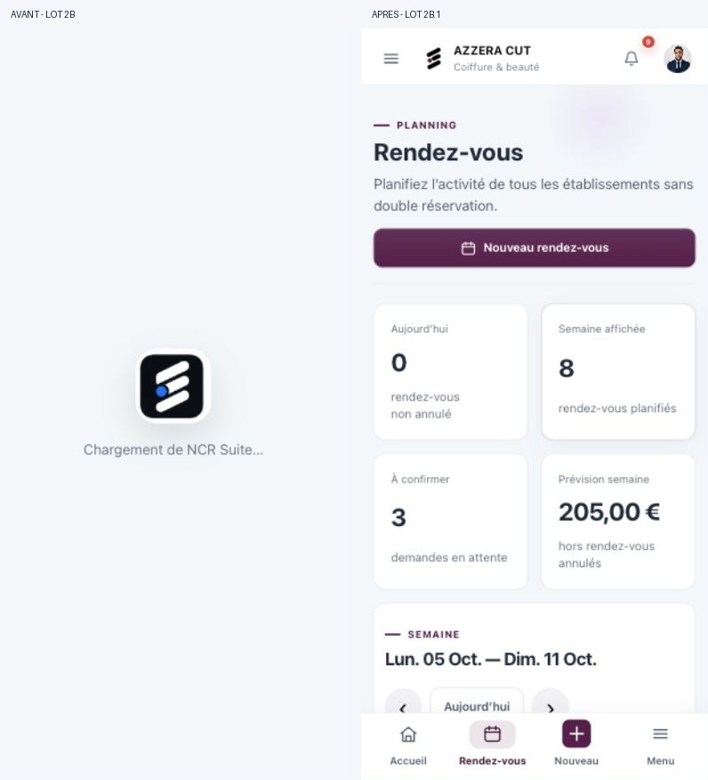

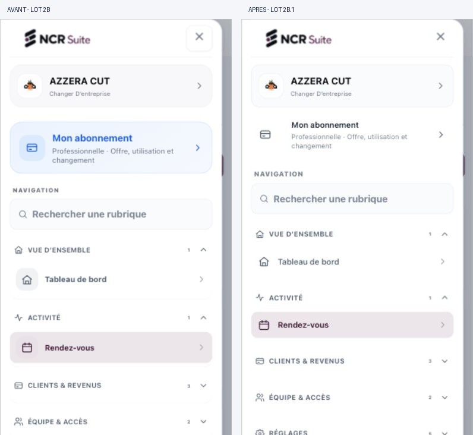

### Tests de cette passe

| Contrôle | Résultat réel |
|---|---|
| Beauty, Formation, Sécurité, Nettoyage, Restauration | 25 vues principales capturées et inspectées, aux **360 / 390 / 430 / 768 / 1440 CSS px mesurés** |
| Scroll / sticky / fixed | Header mobile à y=0 après scroll, sidebar desktop à y=0 ; aucun débordement horizontal global dans les 25 cas |
| Dock / drawer | Ouverture et fermeture dans chaque métier aux quatre formats sous 901 px ; états actifs et labels conservés ; destinations du dock d’environ 64 px de haut |
| Clavier | Shift+Tab depuis Fermer vers Déconnexion, Échap vers Menu ; trois zones inert à l’ouverture, zéro après fermeture |
| Breakpoints | 599 / 600 / 900 / 901 px, aucun débordement ; sidebar visible à 901 et dock masqué |
| TypeScript et build | `npm run build` réussi, incluant `tsc -b`, audits statiques, Vite et SEO ; avertissement de taille du bundle existant |
| Tests | `node --test scripts/ui-foundations.test.mjs` : 5 réussis |
| Console | Aucune erreur relevée dans la session ; avertissements React Router v7 préexistants |
| Diff | `git diff --check` réussi ; aucun changement métier ou route ajouté par 2B.1 |
| Vitrine | Rendue à 400 / 430 / 768 / 1440 px, sans débordement global ; police NCR Public Inter et couleur du titre inchangées. Sur l’origine 127.0.0.1, les cibles 360/390 restent limitées à 400 par le navigateur |
| CSS publics | `src/styles.css` et les deux CSS publics strictement identiques à HEAD ; génération implicite toujours interdite |

Le zoom a été annoncé à 100 % par l’utilisateur dans cette session ; une commande de réinitialisation a également été envoyée. L’API ne fournit pas le réglage de zoom de l’interface du navigateur : ce pourcentage n’est pas indépendamment certifié. La scale du viewport mesurée vaut 1 ; les dimensions CSS ci-dessus ont été lues directement, sans les déduire de la taille des captures.

### Limites et suite

[NON TESTÉ] iPhone physique, clavier virtuel, safe areas réelles, PWA installée, ancien navigateur, lecteurs d’écran, toutes les combinaisons rôle/offre, contraste WCAG exhaustif, reduced-motion via réglage système et mesure FPS/latence. Les styles pressed/hover sont présents ; leur ressenti tactile réel nécessite un téléphone. Aucun changement de données pendant la passe.

Les longs héros, doubles sélecteurs Formation, tableaux, formulaires métier et l’agenda Beauty restent volontairement inchangés : ce sont les futurs lots métier. Les identités personnalisées parfois incohérentes entre espaces restent hors périmètre.

Preuves complètes temporaires : `/tmp/ncr-phase2b1/`, matrice `validation.json`, log `/tmp/ncr-phase2b1-build.log`. Build déplacé hors dépôt, métadonnées TypeScript restaurées. Vite reste disponible pour la validation visuelle. `.env.local` ignoré, absent de l’index et non lu ; lien temporaire `node_modules` non suivi. HEAD reste `f3557d203e4358f61b9f86461d73aa8b1f2218f4`, main reste `63fa0563b51816197b4f6dbbc4de0b5a2a506670`. Aucun commit, push ou déploiement.

### Checkpoint validé des lots 2B + 2B.1

Shell et navigation validés par l’utilisateur comme base de travail. Relecture finale des six fichiers UI : aucun changement de logique métier, route, rôle, permission, offre ou Supabase. Les trois feuilles CSS publiques/héritées restent identiques au checkpoint 2A. `.env.local` ignoré, absent de l’index et non lu ; aucune signature de credential détectée dans les ajouts.

TypeScript et build de la passe finale réussis (log `/tmp/ncr-phase2b1-build.log`) ; cinq tests de protection CSS relancés avec succès au checkpoint. `git diff --check` réussi. Vite arrêté et lien temporaire `node_modules` retiré pour laisser un dépôt propre après commit. Les dépendances, builds et preuves complètes restent hors dépôt.

Commit local autorisé : `refactor(ui): premium app shell and navigation`. Périmètre : six sources UI, ce journal et deux captures avant/après, soit neuf fichiers. Aucun push ni déploiement. `main` conservée à `63fa0563b51816197b4f6dbbc4de0b5a2a506670`.

## Phase 3A — Écrans de référence Beauty et Formation (5 octobre 2026)

Base : `5a6677160025b51d832f4f23d932129efcb74fea`, branche `refactor/premium-app-experience`. Proposition implémentée et contrôlée, **en attente de validation visuelle utilisateur**, sans commit.

### Décisions Beauty

- L’agenda devient la surface principale : en-tête compact, contexte établissement, bouton « Nouveau » secondaire sur mobile et indicateurs regroupés en une bande. Le dock reste le point d’entrée primaire au pouce ; aucune entrée du shell supprimée.
- Création/modification inline conservée pour préserver les handlers et le retour dans le planning. Pendant la saisie, le titre du formulaire remplace le titre de page redondant. Deux sections explicites : client/prestation puis créneau/confirmation. Date et heure côte à côte sur téléphone ; grille sur desktop.
- Recherche client correctement labellisée, sélection et compatibilité collaborateur conservées. Notes facultatives repliées en création et ouvertes en modification ; résumé client/date/heure/prestation avant validation, durée et prix toujours présents. Erreur affichée à proximité de la confirmation, sans doublon. Footer de confirmation sticky sur mobile/tablette, avec réserve pour le dock et safe area.
- Doublon **observé** en vue jour mobile : les deux listes héritées affichaient le même rendez-vous et ses actions. La copie mobile est masquée uniquement lorsque la liste principale est présente, sur cette page Beauty. DOM/classes et actions de la liste principale conservés, notamment « Ajouter sur cette journée » et les indisponibilités. Statuts des cartes jour portés à 12 px.
- Pas de réécriture de l’agenda semaine, de la sélection de créneau ou des transitions de statut.

### Décisions Formation

- « Vue d’ensemble » remplace le grand message de bienvenue. L’organisation/établissement reste identifié dans le contexte et le shell.
- Un seul contrôle de période, avec les mêmes 30/90/365 jours et le même handler. Exports CSV/PDF regroupés sous « Exporter », création de session toujours directe et soumise à la même permission.
- Smart Cockpit exprimé par la typographie, l’espace et les séparateurs, plutôt que plusieurs cartes imbriquées. Priorité à gauche, prochaine activité et raccourcis à droite sur tablette/desktop ; une colonne sur téléphone.
- « À faire ensuite » se replie lorsqu’il n’y a aucun élément secondaire et s’ouvre par défaut lorsqu’il en existe. Calculs, classement, alertes et destinations inchangés.
- Barre d’actions sur une ligne à 768 px ; horloge replacée dans le header desktop, sans consommer une ligne supplémentaire.

### Patterns et maintien du périmètre

Quatre sources UI : `src/pages/AppointmentsPage.tsx`, `src/pages/TrainingDashboardPage.tsx`, `src/components/TrainingDashboardSmartCockpit.tsx`, `src/ncrUi2026Pages.css`. Les règles de composition sont explicitement limitées à `data-reference-screen="beauty"` ou `"formation"` dans le shell. Aucun nouveau fichier CSS, aucune dépendance, aucun changement du shell validé. Tokens NCR UI 2026, icônes, boutons, messages et contrôles natifs existants réutilisés.

Deux contrôles statiques ont été adaptés dans `scripts/phase1-static-audit.mjs` et `scripts/phase1-critical-flows.mjs` : ils exigeaient littéralement l’ancien message de bienvenue et le select mobile redondant. Ils vérifient désormais les trois périodes, le handler, l’état `aria-pressed`, le titre et le contexte organisation. Les gardes de la baseline publique restent intactes.

Patterns éventuellement généralisables **après validation** : bande d’indicateurs, header à contexte court, exports secondaires regroupés, sections opérationnelles sans encadrements imbriqués, notes facultatives et récapitulatif avant confirmation. Ils ne sont pas propagés aux trois autres métiers.

### Confrontation aux références UX

Recherche effectuée pendant cette passe, sans prétendre à une certification ni à un classement des produits de 2026. Les principes sont durables, parfois publiés bien avant 2026 :

- [Nielsen Norman Group — Progressive Disclosure](https://www.nngroup.com/articles/progressive-disclosure/) : réserver la place principale aux actions courantes, rendre les fonctions secondaires accessibles sans les supprimer. Application aux notes, exports et file secondaire du cockpit.
- [GOV.UK — Check answers](https://design-system.service.gov.uk/patterns/check-answers/) : permettre de relire avant de confirmer. Adaptation en résumé inline, sans imposer une étape supplémentaire au professionnel qui enchaîne les rendez-vous.
- Les principes tactiles et focus W3C documentés en 2B.1 restent la référence. Contrôles principaux visés à 44 px, palette et motion existantes conservées. Pas de nouveau blur, bounce ou animation décorative ; pas de prétention à un audit WCAG exhaustif.

### Tests réellement exécutés

| Contrôle | Résultat et limites |
|---|---|
| Références connectées | AZZERA CUT et AZZERA ACADEMY, compte test autorisé |
| Pages principales responsive | 360 / 390 / 430 / 768 / 1440 CSS px finalement mesurés sur les deux pages ; aucun débordement global. Une première passe avait mesuré 391/431 avant recalibration |
| Formulaire Beauty | Contrôlé à 360 / 391 / 431 / 768 / 1440, puis capture mobile finale à 390. Champs, résumé, notes et confirmation accessibles ; pas de débordement global |
| Scroll | Bas des sections atteignable au-dessus du dock dans les mesures ; sidebar desktop indépendante et navigation mobile conservée. Scroll horizontal de la semaine hérité, sans refonte de sa logique |
| Beauty validation | Soumission vide bloquée par validation native ; recherche « nacer » et sélection client ; prestation/collaborateur ; date/heure via saisie native clavier ; erreur de créneau déjà occupé affichée |
| Beauty cycle réel | Rendez-vous créé le 7 octobre 2026 à 10 h, Art nail, client test ; succès et passage de 8 à 9 RDV actifs observés. Modification des notes et statut en attente persistés ; confirmation puis annulation avec motif via la modale. Retour à 8 RDV actifs et 205 € observé. Le rendez-vous annulé reste dans les données du compte test |
| Beauty navigation | Semaine → actions rapides → modifier → vue jour ; filtre Confirmé donnant l’état vide ; retour semaine ; doublon de liste corrigé |
| Formation | Périodes 30/90 jours avec valeurs recalculées ; ouverture/fermeture du détail secondaire ; CTA « Créer une session » ouvre le formulaire existant, fermé sans créer de donnée |
| Exports Formation | Menu et boutons accessibles, CSV/PDF déclenchés, pas d’erreur console observée. **Réception et contenu des fichiers non confirmés** : l’attente de téléchargement du navigateur a expiré et aucune fenêtre PDF exploitable n’a été remontée |
| Shell | Drawer mobile ouvert/fermé ; changement d’organisation mobile et desktop ; liens et états actifs conservés. Sources shell inchangées |
| Console | Aucune erreur enregistrée dans l’onglet de validation et l’onglet vitrine lors du contrôle |
| TypeScript / production | `npm run build` réussi : audits statiques, parcours critiques, release readiness, `tsc -b`, Vite et génération SEO. Avertissement de taille du bundle existant |
| Protection CSS | `node --test scripts/ui-foundations.test.mjs` : 5/5 réussis. `src/styles.css` et les deux CSS publics strictement identiques à HEAD |
| Vitrine | Rendu public inspecté sur l’origine locale non connectée 127.0.0.1. Police NCR Public Inter, aucune racine de référence métier, pas de débordement aux largeurs effectivement obtenues 860 / 1536 / 2880. **Pas de nouvelle validation mobile exacte de la vitrine dans cette passe** : l’override y était multiplié par deux |
| Git / secrets | `.env.local` ignoré et absent de l’index, contenu jamais lu. Pas de fichier Supabase, route, API, permission ou règle d’offre modifié ; aucun changement de main |

La saisie automatisée `fill` des champs date/heure n’actualisait pas le state React dans cet environnement. La saisie native clavier a déclenché les handlers existants et mis à jour le résumé. Aucun contournement par JavaScript, accès direct aux données ou modification backend utilisé.

### Comparaisons visuelles

Captures avant/après à 390 et 1440 CSS px. Les exports image du navigateur incluent des marges ; celles-ci sont recadrées. Les vues desktop sont cadrées sur la zone de travail, sans pied de compte. La définition des exports desktop est limitée par le navigateur : se fier également à la version locale ouverte. Les données actives sont comparables ; le test a ajouté un rendez-vous ensuite annulé et incrémenté les notifications.

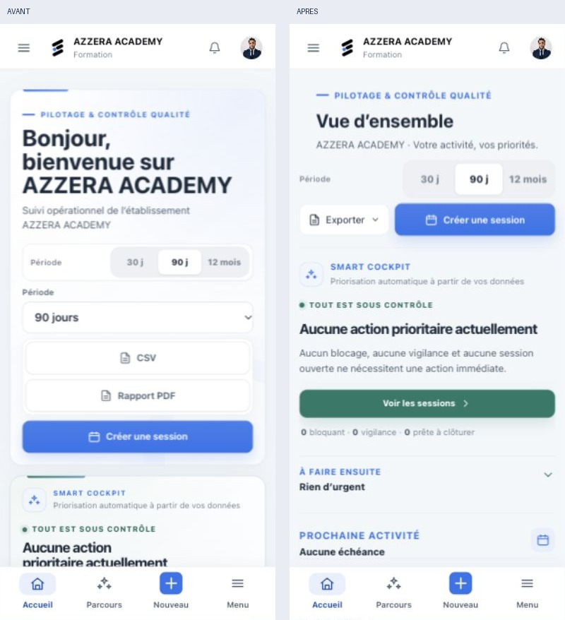
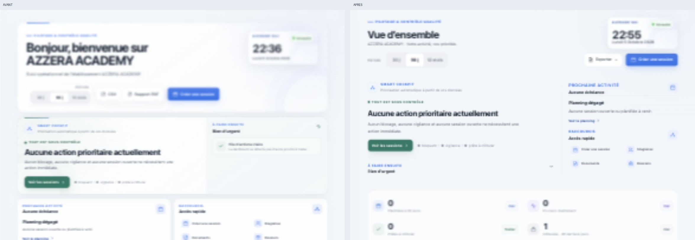
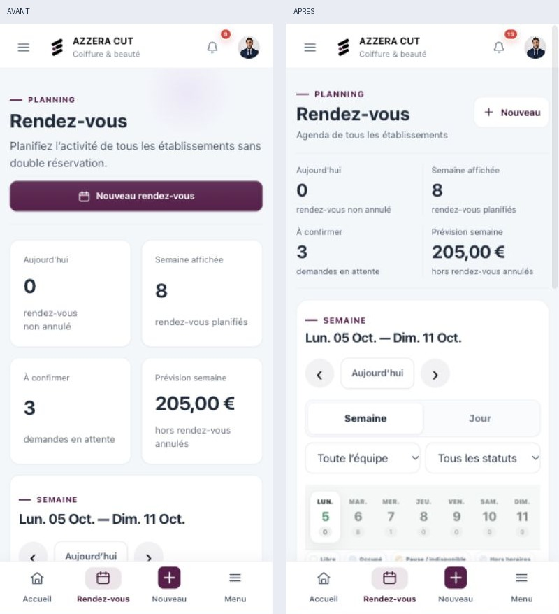
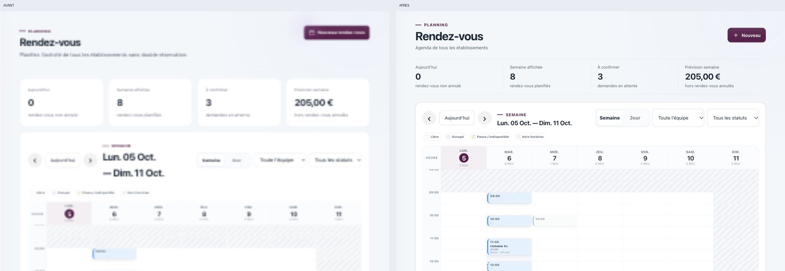
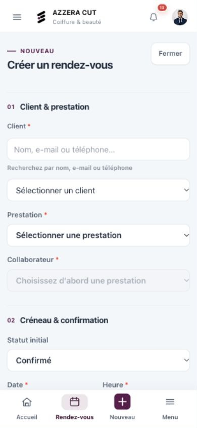

### Compromis et limites

- Le formulaire reste inline et se parcourt verticalement ; les sélections natives sont conservées pour éviter un nouveau système de combobox/bottom sheets fragile. Il n’est pas transformé en wizard à étapes obligatoires.
- L’agenda semaine garde sa dette de densité et certains très petits textes hérités. Ce lot améliore son entrée et ses actions ; il ne constitue pas une validation finale de toute la grille agenda.
- Données Formation sans urgence secondaire : rendu urgent ouvert déduit de la condition conservée, pas reproduit artificiellement. Toutes les variantes rôle/offre, établissement Métier, appareils iOS réels, clavier virtuel, safe areas matérielles, PWA installée, lecteur d’écran et reduced-motion système restent non testés.
- Aucun indicateur métier ni handler de sauvegarde/export recalculé ou réécrit. Aucune infrastructure distante modifiée. Les tests UI ont uniquement modifié le rendez-vous test via l’application.
- Logs et preuves détaillées : `/tmp/ncr-phase3a/`, build final `/tmp/ncr-phase3a-build-final.log`. Métadonnées TypeScript remises à HEAD et build déplacé hors dépôt après vérification. Vite reste lancé pour la validation utilisateur ; lien temporaire `node_modules` non versionné.
- HEAD reste `5a6677160025b51d832f4f23d932129efcb74fea`, main reste `63fa0563b51816197b4f6dbbc4de0b5a2a506670`. Aucun commit, push ni déploiement. Ne pas généraliser ces patterns avant validation visuelle.

## Phase 3A.1 — Direction artistique : hiérarchie éditoriale et surfaces sobres

Passe réalisée le 5 octobre 2026 sur la branche `refactor/premium-app-experience`, par-dessus les changements 3A encore non commités. À valider visuellement. Cette passe ne modifie que quatre feuilles CSS et la documentation ; aucun nouveau changement TSX, route, permission, calcul, donnée ou élément Supabase.

### Ce qui change par rapport à 3A

- **Dashboard Beauty** : suppression de l'encadrement du hero et des cartes KPI répétées. Label métier avec filet discret, titre plus affirmé, informations de contexte regroupées et CTA toujours accessibles. Hero mobile mesuré à environ 225 px aux trois petites largeurs ; les deux boutons tiennent sur une ligne, avec environ 44 px de hauteur. Les accès rapides deviennent des lignes espacées avec séparateurs. Les prochains rendez-vous gardent horaires, montants et statuts, avec une accentuation sobre du premier. Les textes de synthèse sont relevés à 12–14 px au lieu des miniatures héritées. L'agenda lui-même n'est pas refondu.
- **Formation** : le Smart Cockpit devient la surface blanche principale, avec une priorité typographique claire et des séparateurs internes. Les KPI secondaires deviennent une bande sans accumulation de cartes ; quatre colonnes sur grand desktop, deux sur téléphone/tablette. L'horloge perd sa carte décorative. Les zones d'analyse restent plus discrètes que le cockpit. Correction du contraste de la synthèse qualité : ses anciens textes blancs étaient illisibles après le passage à une surface claire en 3A. Descriptions à 13 px et légendes du graphique à 12 px.
- **Navigation** : états actifs plus pâles et repère vertical de 2 px ; lien dashboard desktop sans gradient ni ombre. Le bloc organisation du drawer devient une ligne ouverte avec séparation basse. Recherche plus sobre. Structure, dimensions tactiles principales, routes, groupes, scroll et mécanismes du shell conservés.

Le choix esthétique consiste à réserver la surface la plus présente à la priorité de travail, puis à organiser les informations secondaires par la taille des caractères, le rythme et les filets. L'accent Beauty et les tokens NCR existants restent les seuls repères chromatiques. Aucun nouvel effet glass, animation décorative, bibliothèque ou design system parallèle.

### Fichiers propres à cette passe

| Fichier | Rôle |
|---|---|
| `src/beautyUniverse.css` | Consolidation des anciennes couches du dashboard en règles source ; surfaces de configuration/centre conservées |
| `src/ncrUi2026Pages.css` | Ajustement de la composition Formation déjà introduite en 3A, KPI et contraste de la synthèse |
| `src/ncrUi2026.css` | Finition des états actifs, recherche et organisation du drawer |
| `src/ncrUi2026TrainingSidebarPolish.css` | Finition du lien dashboard partagé entre métiers |
| `docs/premium-redesign/07_PROGRESS.md` et `captures/phase-3a1/` | Suivi et cinq comparaisons avant/après |

Les fichiers TSX et les deux scripts de contrôle déjà modifiés en 3A restent dans le working tree ; ils ne constituent pas de nouvelles modifications fonctionnelles de 3A.1. Aucun empilement d'une nouvelle section Beauty versionnée.

### Vérifications réellement réalisées

| Contrôle | Résultat |
|---|---|
| Beauty connecté, AZZERA CUT | 360 / 390 / 430 / 768 / 1440 **CSS px mesurés**, rendu et scroll contrôlés, débordement global nul |
| Formation connectée, AZZERA ACADEMY | Même série de cinq largeurs exactes, débordement global nul ; cockpit, KPI, graphique et synthèse vérifiés |
| Drawer | Ouverture/fermeture aux quatre largeurs mobiles/tablette ; comparaison Formation à 390 px ; navigation basse préservée |
| Navigation et sidebar | Changements d'organisation par l'interface ; état actif conservé, sidebar desktop immobile pendant le scroll du contenu |
| CTA Beauty | Ouverture réelle de « Nouveau rendez-vous », formulaire existant visible, fermeture sans sauvegarde |
| Données | Aucune création, modification ou suppression pendant cette passe |
| TypeScript et production | `npm run build` réussi : contrôles statiques, parcours critiques, release readiness, `tsc -b`, Vite et SEO. Avertissement existant de taille du bundle |
| Tests des fondations | `node --test scripts/ui-foundations.test.mjs` : 5/5 réussis |
| Console | Aucune erreur enregistrée dans les onglets application et vitrine contrôlés |
| Vitrine locale non connectée | Rendu inspecté à 480 et 1440 CSS px, sans débordement ni racine app-shell. Le navigateur impose ici un minimum réel de 480 px ; aucune prétention à un contrôle public exact à 360/390/430 pendant cette passe |
| CSS publics | `src/styles.css`, `public/ncr-suite-showcase-v2925.css`, `public/ncr-suite-app-v2925.css` identiques octet pour octet à HEAD |
| Git et secrets | `.env.local` ignoré, absent de l'index, jamais lu. Scan de signatures de secrets du diff sans résultat ; `git diff --check` réussi |

Captures avant/après prises avec les mêmes largeurs CSS, marges de l'export navigateur recadrées et échelle rétablie pour comparaison. Les desktops sont cadrés sur le contenu et le drawer avant le pied de compte. La résolution native de l'export limite leur netteté ; la version locale est laissée ouverte pour apprécier le rendu réel.

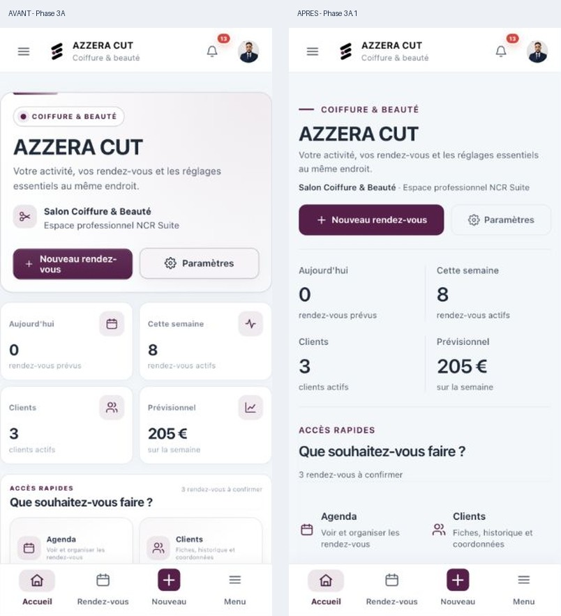
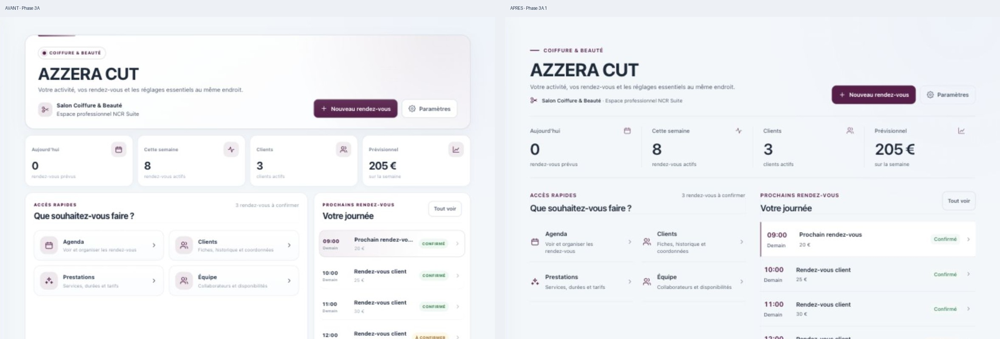
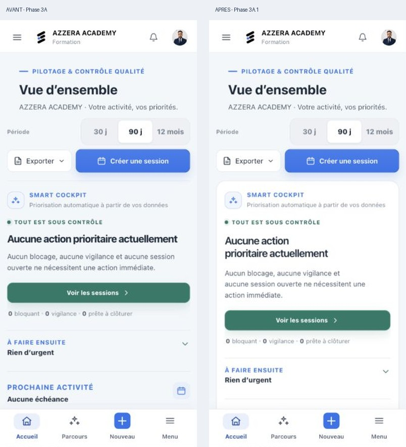
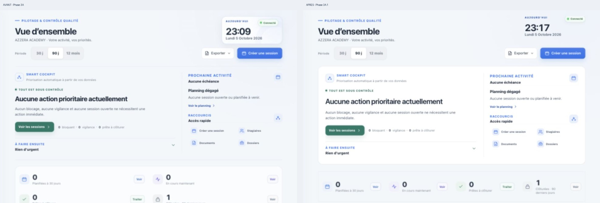
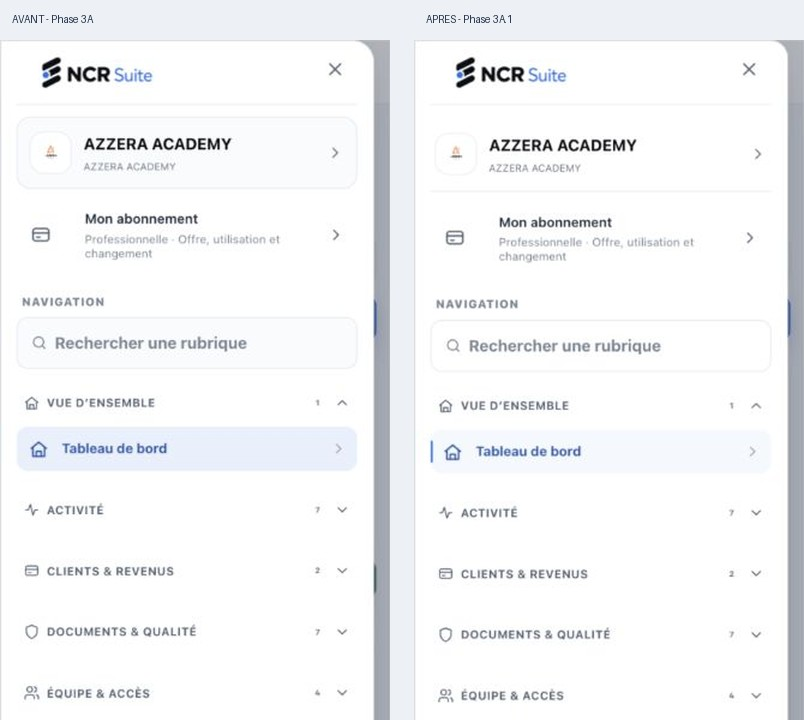

### Limites et état de livraison

- Pas de nouvelle validation exhaustive des pages Sécurité, Nettoyage et Restauration ; les changements partagés de navigation restent purement CSS. Toutes les offres/rôles et le centre Beauty Métier ne sont pas couverts par ce compte de référence.
- Variantes Formation urgentes non reproduites ; états testés avec les données disponibles. Tests physiques iOS, clavier virtuel, PWA installée et lecteur d'écran non réalisés. Reduced-motion conservé dans les règles et ajouté aux transitions Beauty, sans simulation système supplémentaire.
- La synthèse basse Formation a été revue après correction du contraste ; les comparaisons ci-dessus montrent principalement le haut des pages. Captures et mesures complémentaires : `/tmp/ncr-phase3a1/`. Build final : `build-verified.log` dans ce dossier.
- Artefacts du build déplacés hors dépôt et métadonnées TypeScript rétablies. Le lien local `node_modules` reste non versionné. Vite reste disponible pour la validation.
- HEAD inchangé : `5a6677160025b51d832f4f23d932129efcb74fea`. Main inchangée : `63fa0563b51816197b4f6dbbc4de0b5a2a506670`. Aucun commit, push ou déploiement. Travail arrêté pour validation visuelle.

## Checkpoint final 3A / 3A.1 — Non-régression et commit local

Validation effectuée le 5 octobre 2026 après acceptation de la direction visuelle. Aucune nouvelle modification esthétique ou applicative pendant ce checkpoint.

| Métier / écran | 390 px | 768 px | 1440 px |
|---|---|---|---|
| Sécurité / Planning agents | Conforme au périmètre CSS | Conforme au périmètre CSS | Conforme au périmètre CSS |
| Nettoyage / Planning interventions | Conforme au périmètre CSS | Conforme au périmètre CSS | Conforme au périmètre CSS |
| Restauration / Commandes | Conforme au périmètre CSS | Conforme au périmètre CSS | Conforme au périmètre CSS |

Largeurs CSS réellement mesurées, débordement global nul dans les neuf cas. Header, typography, couleurs métier, surfaces, boutons et états actifs inspectés ; drawers ouverts/fermés sur téléphone et tablette. Scroll du menu Restauration jusqu'aux commandes et aux réglages, bas des contenus mobile/tablette accessible au-dessus du dock. Sidebar desktop à top=0 après scroll. Les tableaux/plannings et rangées de choix gardent leur scroll interne ; pas de nouvelle superposition bloquante observée. Aucun formulaire sauvegardé, aucune commande envoyée ou donnée créée/modifiée/supprimée pendant ce contrôle. La commande déjà ouverte a uniquement été consultée. Nettoyage est testé sans agent actif : action Planifier désactivée avec explication, variante dense non couverte.

**Observation hors périmètre** : après passage depuis Sécurité en marque blanche, le logo et/ou le titre « Azzera Protect » peuvent persister dans le shell d'un autre métier, alors que le sélecteur d'entreprise et son drawer identifient correctement l'espace actif. Ce résidu DOM est observé, pas corrigé. Le mécanisme `MetierRuntimeBranding.tsx` modifie directement images/titre et les restaure lors du nettoyage ; fichier strictement identique à HEAD. Les CSS 3A.1 ne modifient ni nom d'entreprise, ni src/alt d'image, ni document.title. [Inférence] Le résidu relève du cycle de personnalisation existant et non des changements CSS du lot. À traiter séparément ; aucune extrapolation sur les accès ou données entre entreprises.

Validation technique : `npm run build` réussi (audits statiques, parcours critiques, release readiness, TypeScript `tsc -b`, Vite, SEO), `node --test scripts/ui-foundations.test.mjs` 5/5, aucune erreur console enregistrée. Avertissements non bloquants Vite sur taille de chunk et durée de plugin. `git diff --check` réussi. Les deux scripts de contrôle modifiés en 3A vérifient les nouveaux libellés/contrôles visuels sans supprimer les gardes fonctionnelles.

CSS publics `src/styles.css`, `public/ncr-suite-showcase-v2925.css`, `public/ncr-suite-app-v2925.css` identiques octet pour octet à la base. `.env.local` ignoré et absent de l'index ; contenu non lu. Relecture du diff : changements de présentation et interactions UI seulement, aucun changement de calcul métier, route, permission, infrastructure Supabase ou fichier de données. Les essais métier autorisés de 3A restent ceux décrits dans la section précédente ; aucune donnée de base exportée/versionnée. Scan de signatures de secrets sans résultat.

Preuves temporaires : `/tmp/ncr-phase3-final/` (neuf captures et mesures JSON), log `/tmp/ncr-phase3-final-build.log`. Captures non ajoutées au dépôt pour éviter des vues de compte inutiles ; les comparaisons 3A/3A.1 sont conservées. Build déplacé hors dépôt, métadonnées TypeScript rétablies. Le lien de dépendances `node_modules` est exclu localement de Git, sans changement du `.gitignore` versionné.

Commit local demandé : `refactor(ui): premium reference screens for beauty and training`. Contenu : sept fichiers UI, deux scripts de contrôle, ce suivi et dix captures des phases 3A/3A.1. Main demeure `63fa0563b51816197b4f6dbbc4de0b5a2a506670`. Aucun push ni déploiement.

## Phase 4 — Agenda Beauty premium — 6 octobre 2026

Base : `7cd61c593e7bc3b239b24c35b53635260661a35f`, branche `refactor/premium-app-experience`. Lot limité à la présentation de l'agenda et ses interactions UI. Aucun changement de gestion des rendez-vous, droits, routes, disponibilités ou infrastructure Supabase.

### Fichiers et choix UX

- `src/pages/AppointmentsPage.tsx` : échelle temporelle Beauty de 3,2 px/minute, partagée avec le calcul du point cliqué pour conserver l'heure de création ; largeur des jours adaptée aux rendez-vous simultanés (220 px minimum, 170 px par couloir). L'architecture reste une semaine par jours, sans inventer une vue par collaborateurs. Positionnement initial sur le jour sélectionné sur petit écran. Statut textuel, durée séparée du nom, libellé accessible complet. Fiche rapide : début/fin/durée, focus clavier, Échap et restitution du focus.
- `src/beautyAppointmentWeekPlanner.css` : consolidation des règles existantes. Surface calme, repères horaires et dates sticky, distinction libre/occupé/pause/hors horaires, statuts par couleur et texte. Clients 14 px, informations usuelles 12 px. Les rendez-vous de 15 min conservent une hauteur de 44 px : heure/statut/client en priorité, autres informations dans la fiche au toucher ou la liste du jour. Les rendez-vous longs permettent deux lignes de prestation/collaborateur. Contrôles et fermeture de fiche à 44 px, safe area et mouvement réduit pris en compte.
- `src/beautyMobileResponsive.css` : retrait des seules anciennes surcharges `.beauty-week-*`, désormais consolidées dans leur source. Comparaison structurée : autres sélecteurs/déclarations et contextes média inchangés.
- `src/ncrUi2026Pages.css` : badge de statut de la liste Beauty restauré à 12 px. `!important` nécessaire contre la règle héritée à 7 px du CSS public gelé ; exception strictement limitée à l'écran Beauty.
- Ce fichier de suivi.

Le calendrier possède volontairement son propre défilement horizontal et vertical, borné en hauteur ; la page défile autour. Ce compromis conserve simultanément les dates et les heures pendant le parcours d'une journée. Ce n'est pas une suppression de tout scroll imbriqué. En cas de simultanéité, le jour s'élargit et les couloirs supplémentaires se parcourent horizontalement au lieu de comprimer leur texte. Pas de dépendance ajoutée ni d'effet coûteux répété sur les cartes.

### Validation connectée réelle

Tests via l'interface de l'espace test AZZERA CUT, offre Professionnelle. Création d'un collaborateur fictif « Camille Atelier — test agenda » sans compte/invitation, de deux prestations de test (15 et 90 min), puis de trois rendez-vous le 6 octobre (15, 30 et 90 min). Équipe finale : deux collaborateurs ; journée : onze rendez-vous non annulés. Les données de test sont laissées disponibles pour la validation visuelle, sans export ni versionnement.

[VÉRIFIÉ VISUELLEMENT] Largeurs CSS exactes 360, 390, 430, 768 et 1440 px ; DPR 1 et visualViewport.scale 1 sur localhost. Débordement global mesuré : 0 dans les cinq cas. Vue semaine, en-têtes/heures sticky, défilements, bottom bar, fiche rapide et texte long contrôlés. Fin du calendrier accessible au-dessus de la navigation mobile après scroll de page. Tablette : agenda borné avec défilement interne ; desktop : sidebar stable et plusieurs jours visibles, sans élargissement artificiel des jours peu chargés.

[VÉRIFIÉ VISUELLEMENT] Journée dense et journée vide, rendez-vous simultanés, noms longs, créneaux courts/longs, plages libres, pauses récurrentes et horaires fermés. Création, édition des notes, passage « Pas venu », filtres équipe/statut, navigation semaine/jour et retour à aujourd'hui réussis. Clic sur une plage libre du mercredi à 11 h : formulaire ouvert au bon jour et à 11 h, puis fermé sans sauvegarde. Fiche rapide : ouverture/fermeture, Échap et retour du focus au rendez-vous vérifiés. Les statuts Confirmé et Pas venu ont été réellement observés ; un filtre Terminé sans résultat a vérifié l'état vide, pas une carte terminée.

[VÉRIFIÉ VISUELLEMENT] Dashboard Beauty revu à 360 et 1440 px : composition conservée, sans débordement ; ses chiffres reflètent les données de test ajoutées. Landing ouverte séparément en session publique : rendu observé sans anomalie ; contrôle complémentaire octet pour octet des trois CSS publics identiques à HEAD.

### Tests et limites

- `npm run build` réussi : audit statique, parcours critiques statiques, release readiness, TypeScript `tsc -b`, Vite et SEO. Avertissement non bloquant sur la taille de chunks, sans nouvelle dépendance.
- `node --test scripts/ui-foundations.test.mjs` : 5/5 réussis. `git diff --check` réussi. Console du navigateur : aucune erreur enregistrée au contrôle final.
- [NON TESTÉ] Absence dédiée : contrôle de blocage du temps non accessible dans ce mode/offre, sans contournement. Pauses récurrentes effectivement testées. Très nombreuses équipes, appareils iOS physiques, gestes natifs et benchmark de fluidité non couverts. Respect de `prefers-reduced-motion` contrôlé dans le CSS, sans changement du réglage système.
- Anomalie antérieure « Terminer refusé » conservée comme baseline, non corrigée et non réexécutée pour fabriquer un état terminé. Aucune promesse de correction métier.
- Captures temporaires hors dépôt : `/tmp/ncr-phase4/before-agenda-390.jpg`, `/tmp/ncr-phase4/after-final-390.jpg`, `/tmp/ncr-phase4/after-360.jpg`, `/tmp/ncr-phase4/after-430.jpg`, `/tmp/ncr-phase4/after-768.jpg`, `/tmp/ncr-phase4/after-1440.jpg`, `/tmp/ncr-phase4/long-sheet-360.jpg`. Mesures : `/tmp/ncr-phase4/validation.json`. Avant/après : échelle temporelle volontairement différente et rendez-vous de test supplémentaires.
- `.env.local` ignoré et absent de l'index ; contenu jamais lu. CSS publics inchangés, pas de fichier Supabase modifié. Artefacts de build déplacés dans `/tmp/ncr-phase4/production-build`, métadonnées TypeScript rétablies.
- HEAD reste `7cd61c593e7bc3b239b24c35b53635260661a35f`, main reste `63fa0563b51816197b4f6dbbc4de0b5a2a506670`. Aucun commit, push ou déploiement. Lot laissé non commité pour validation visuelle.

## Checkpoint Phase 4 — validation et commit local

Diff final limité aux quatre fichiers UI de l'agenda ci-dessus et à ce suivi. Aucun changement métier imprévu, route, permission ou infrastructure Supabase. Styles mobiles hors agenda comparés structurellement : identiques. Les trois CSS publics restent identiques octet pour octet à HEAD après build. `.env.local` ignoré et absent de l'index, contenu non lu ; aucune signature de secret détectée dans les ajouts.

Validation visuelle Phase 4 conservée sans modification applicative depuis : agenda aux cinq largeurs, shell et dashboard Beauty contrôlés. Aucun nouveau test de données pendant ce checkpoint. `npm run build` relancé avec succès (TypeScript, audits statiques, Vite et SEO) ; `node --test scripts/ui-foundations.test.mjs` : 5/5 ; `git diff --check` réussi. Avertissement non bloquant de taille de chunks. Artefacts de build retirés du dépôt, métadonnées TypeScript rétablies.

Commit local autorisé : `refactor(beauty): premium agenda experience`. Branche `refactor/premium-app-experience` ; main conservée à `63fa0563b51816197b4f6dbbc4de0b5a2a506670`. Aucun push ni déploiement.

## Propagation du standard premium — Sécurité et Nettoyage — 6 octobre 2026

Base : `020232d920eeae8f84e84cf5f24f0c4a5b1fa697`, branche `refactor/premium-app-experience`. Quatre fichiers applicatifs concernés : `src/securityUi.css`, `src/cleaningUi.css`, `src/pages/SecurityPlanningPage.tsx`, `src/pages/CleaningPlanningPage.tsx`. Modifications des règles sources existantes ; aucune nouvelle bibliothèque ni couche CSS versionnée.

**Écrans / patterns.** Headers métier allégés (sans panneau décoratif), synthèses regroupées, lignes de listes moins encadrées, petits textes relevés à 12 px minimum dans les règles opérationnelles ciblées. Tokens NCR UI 2026, badges, formulaires et navigation existants conservés. Les styles partagés bénéficient aux dashboards, agents, sites et interventions ; pas de réécriture de leurs composants. Contrôles visuels ciblés sur dashboards Sécurité/Nettoyage, agents Sécurité/Nettoyage, sites Nettoyage, interventions Nettoyage et les deux plannings. Les autres pages utilisant ces styles partagés n'ont pas reçu d'audit individuel.

**Adaptations planning.** Sécurité conserve sa semaine par site, Nettoyage sa semaine par agent et ses vues jour/mois. Colonnes de jours de 220 px pour la lisibilité ; repères latéraux fixes (112 px sur petit écran Sécurité, 190 px ailleurs). Correction de l'overflow hérité de la grille qui empêchait les repères sticky de rester visibles. Défilement interne borné à 65dvh, sans supprimer le défilement de page ; fin de planning mobile accessible au-dessus du dock. Boutons de cellule de 44 px, labels accessibles décrivant site/agent/date. Les cartes de semaine exposent désormais le statut en texte avec les badges existants. Nettoyage mobile : vue journalière existante conservée, grille explicite heure/détails, marqueur décoratif retiré de cette seule vue, intitulé et agent autorisés à revenir à la ligne, suppression du double espace de protection inférieur.

**Tests connectés.** Plannings réellement contrôlés à 360, 390, 430, 768 et 1440 px CSS, DPR 1, visualViewport.scale 1, aucun débordement global mesuré. Mobile : header/dock, drawer, formulaire Sécurité ouvert puis fermé sans soumission, liste d'intervention longue et fin de contenu. Tablette/desktop : toolbar, cartes, sidebar et scroll horizontal. Repère site vérifié à gauche=15 px après scrollLeft=780 ; repère agent vérifié au bord du conteneur après scrollLeft=1026. Nettoyage : navigation Mois/Jour/Semaine, filtre agent, journée vide et retour à aujourd'hui. Dashboard Beauty et Formation revus rapidement sur mobile ; aucune règle de ces métiers modifiée. Landing publique observée séparément et trois CSS publics comparés octet pour octet à HEAD : inchangés.

**Données de test autorisées.** Dans Azzera Service + seulement : une fiche fictive « Camille Test exploitation » sans compte/invitation et une intervention le 6 octobre de 13 h à 15 h, avec un intitulé long. Création via l'interface réussie. Une tentative de second passage a été refusée par le contrôle de chevauchement : la saisie automatisée des nouvelles heures n'avait pas persisté dans les champs natifs, donc le créneau soumis était celui déjà occupé. Aucun second passage créé, aucun contournement. Les données de test restent disponibles pour validation ; aucun export de données ni modification directe Supabase.

**Limites et baseline.** Sécurité : deux agents, quatre sites, aucune mission dans la semaine consultée. Le bug préexistant de création refusée avec message générique n'est ni corrigé ni réexécuté. La présentation des cartes de mission est déduite du code, non validée sur une semaine dense réelle. Nettoyage : un seul agent et une seule intervention réelle ; fortes densités et pluralité de statuts non validées. Résidu connu du branding Azzera Protect lors du changement de métier toujours observé, hors périmètre (un rechargement rétablit l'identité Nettoyage). Le formulaire Nettoyage peut conserver un message de succès antérieur à côté d'un nouvel échec ; comportement préexistant non modifié. Pas de mesure sur téléphone physique ou de benchmark de performance.

**Technique.** `npm run build` : TypeScript `tsc -b`, audits statiques, parcours critiques, release readiness, Vite et SEO. `node --test scripts/ui-foundations.test.mjs` : 5/5. Console consultée : aucune erreur enregistrée. Avertissement de taille de chunks non bloquant. `git diff --check` conforme. Aucun changement de calcul métier, mutation, route, rôle, permission, Auth, schéma ou fonction Supabase. `.env.local` ignoré, absent de l'index et jamais lu. Main conservée à `63fa0563b51816197b4f6dbbc4de0b5a2a506670`. Aucun commit, push ni déploiement.

Preuves temporaires : `/tmp/ncr-phase5/` (captures des cinq largeurs, `securite-scroll-390.jpg`, mesures `qa.json`, logs build/tests). Lot laissé non commité pour validation visuelle.

## Checkpoint Phase 5A — commit local

Diff final : quatre fichiers UI Sécurité/Nettoyage et ce suivi uniquement. Comparaison des deux pages avec HEAD : logique avant rendu et gestionnaires d'événements identiques. Le bug de création de mission Sécurité reste inchangé, sans contournement ni masquage. Toutes les règles CSS modifiées restent limitées au thème métier concerné ; aucune modification de Beauty, Formation ou du Premium App Shell depuis leurs contrôles visuels du lot. Aucun changement Supabase, RLS, Auth, migration, RPC ou Edge Function.

Validation relancée : `npm run build` réussi, incluant TypeScript, audits statiques, parcours critiques, release readiness, Vite et SEO ; `node --test scripts/ui-foundations.test.mjs` : 5/5 ; `git diff --check` conforme. Seul avertissement non bloquant : taille des chunks. CSS publics identiques octet pour octet après build. `.env.local` ignoré et absent de l'index, contenu non lu ; aucune signature de secret détectée dans les ajouts. Artefacts de build sortis du dépôt et métadonnées TypeScript rétablies.

Commit local demandé : `refactor(ui): premium security and cleaning experiences`. Branche `refactor/premium-app-experience`, main inchangée à `63fa0563b51816197b4f6dbbc4de0b5a2a506670`. Aucun push ni déploiement.

## Phase 5B — propagation premium Restauration — 6 octobre 2026

Base : `11c8f85d3458b000e8fb6132d624b70446bbc80b`, branche `refactor/premium-app-experience`. Fichiers : `src/pages/RestaurantOrdersPage.tsx`, `src/ncrUi2026Pages.css` et ce suivi. Écrans concernés : prise de commande / note et dashboard Restauration. Pas de refonte des autres pages métier.

**Patterns et adaptations.** Réutilisation des tokens NCR UI 2026, du shell, des boutons, états et surfaces existants. Headers allégés, synthèse du dashboard regroupée (deux colonnes sur téléphone), lignes de note séparées sobrement. Tables et catégories en bandes horizontales. Catalogue tactile à deux colonnes sur téléphone, trois sur tablette ; desktop avec carte et note côte à côte, note sticky à défilement borné. Mobile/tablette : bascule « Carte / Note » avec nombre de lignes et total existant, sans dupliquer les formulaires. La note ne se trouve plus après tout le catalogue. Correction locale de l’overflow hérité du conteneur pour rendre cette barre réellement sticky (top mesuré 64 px après scroll). Quantités avec boutons 44 px ; instructions en 16 px ; statuts de ligne explicites, textes opérationnels 12–16 px. Effets sobres et mouvement réduit respecté.

**Tests connectés.** Compte test Azzera Food, offre Professionnelle. Catalogue de neuf produits, filtre Pizza, recherche sans résultat et retour à Tout. Commande courte existante n°7 : 10 €. Ajout Pizza 4 fromages : 22 €, quantité portée à deux : 34 €, Tiramisu : 39 €, soda : 42 €. Instruction longue enregistrée via le formulaire, conservée après rechargement. Quatre lignes / cinq unités. Envoi cuisine réussi, feedback de succès et articles « Envoyé », quantités verrouillées conformément au fonctionnement antérieur. Préparation de la note réussie : « À encaisser », total 42 €, catalogue verrouillé. Aucun règlement ni clôture effectué. Données de test laissées dans le compte, sans export/versionnement ni mutation directe Supabase.

**Responsive et contrôles croisés.** Catalogue et note observés aux largeurs CSS 360, 390, 430, 768 et 1440 px, zéro débordement global mesuré. Première passe avec zoom 120 % compensé par viewport ; dernière passe catalogue à DPR 1 / scale 1 et dimensions exactes. Bas de note accessible au-dessus du dock à 390 px ; barre Carte/Note vérifiée sticky après correction. Dashboard revu sur mobile et desktop. Contrôle rapide des accueils Beauty, Formation, Sécurité et Nettoyage sur mobile, sans nouvelle anomalie de composition constatée ; ce contrôle ne constitue pas un nouvel audit fonctionnel exhaustif. Résidu de branding Azzera Protect lors des changements d’entreprise toujours présent, rétabli après rechargement, hors périmètre. Vitrine publique ouverte séparément et trois CSS publics comparés octet pour octet : inchangés.

**Technique et limites.** Build production avec TypeScript `tsc -b`, audits statiques, parcours critiques, release readiness, Vite et SEO ; cinq tests `scripts/ui-foundations.test.mjs` réussis. Avertissement de taille des chunks non bloquant. Console consultée : aucune erreur enregistrée. Logique avant rendu comparée à HEAD : identique après retrait du seul état UI Carte/Note ; gestionnaires de commande, calculs, routes et permissions conservés. Aucun fichier Supabase modifié. `.env.local` ignoré, non versionné et jamais lu. Pas de test sur téléphone physique / clavier iOS, ni de charge extrême, ni du cycle complet de préparation cuisine. Les statuts intermédiaires non produits restent non validés visuellement. Captures temporaires dans `/tmp/ncr-phase5b/`, notamment `catalogue-final-390.png`, `catalogue-final-1440.png` et `note-ready-final-390.png` ; les premières captures à zoom 120 % présentent un artefact d’échelle du navigateur.

Main conservée à `63fa0563b51816197b4f6dbbc4de0b5a2a506670`. Aucun commit, push ni déploiement. Lot laissé non commité pour validation visuelle.

## Checkpoint Phase 5B - commit local

Diff final : RestaurantOrdersPage.tsx, styles Restauration dans ncrUi2026Pages.css et ce suivi uniquement. Comparaison avec HEAD : logique avant rendu et gestionnaires metier identiques, hors etat de presentation Carte/Note. Aucun changement de calcul, route, permission ou infrastructure Supabase. Controles visuels du lot conserves sans nouvelle modification applicative : autres metiers et shell exclus des nouveaux selecteurs.

Validation relancee : npm run build reussi (TypeScript, audits statiques, parcours critiques, release readiness, Vite et SEO), cinq tests de protection des CSS publics reussis, git diff --check conforme. Avertissement non bloquant de taille des chunks. CSS publics identiques apres build ; .env.local ignore et absent de l'index, contenu non lu ; aucune signature de secret detectee. Artefacts de build sortis du depot, metadonnees TypeScript retablies.

Commit local demande : refactor(ui): premium restaurant experience. Branche refactor/premium-app-experience ; main conservee a 63fa0563b51816197b4f6dbbc4de0b5a2a506670. Aucun push ni deploiement.

## Phase 6A — stabilisation fonctionnelle ciblée — 6 octobre 2026

Base : `9c7ca5ec5544218d57db8b39e8c0fa63cfce5602`, branche `refactor/premium-app-experience`. Aucune nouvelle passe esthétique. Deux composants modifiés : `src/components/MetierRuntimeBranding.tsx`, `src/components/MetierBrandSwitcher.tsx`, plus ce suivi. Diagnostic distant limité aux fonctions, policies, relations et logs utiles des deux refus sur NCRsuite ; aucune mutation directe Supabase.

### Beauty — Terminer : reproduit, cause confirmée, correction distante non appliquée

- [VÉRIFIÉ] Compte test AZZERA CUT Professionnelle : rendez-vous historique de 09:00–09:30, Art nail, action Terminer refusée avec « Mise à jour impossible : La fidélité doit rester dans l’enseigne du client. ». Le statut reste Confirmé. Le rendez-vous test de 10:30–10:45 a, lui, été terminé avec succès par cette même interface ; c'est la seule mutation de données métier réussie dans ce lot.
- `AppointmentsPage.changeStatus` vérifie rôle et changement effectif, puis appelle `set_appointment_status` avec l'organisation courante, l'identifiant du rendez-vous, `p_status=completed`, `p_cancellation_reason=null`. La RPC contrôle l'utilisateur et `can_access_appointment`, puis met à jour le statut. Le refus réel survient dans le traitement de fidélité déclenché par cette mise à jour ; ce n'est pas un refus frontend ni une preuve de permission manquante.
- [VÉRIFIÉ À DISTANCE] Le rendez-vous refusé possède `company_id=null`, son client une enseigne non nulle. `process_coiffure_appointment_loyalty` emprunte alors la branche historique sans enseigne et tente d'écrire la fidélité sans `company_id`. `beauty_enforce_loyalty_company_scope` refuse cette différence avec l'enseigne du client. Le rendez-vous réussi et son client ont tous deux une enseigne nulle. Log postgres du refus : 2026-10-06 16:09:12 UTC, même erreur présente avant ce lot.
- **Correction nécessaire à valider** : définir l'enseigne correcte des rendez-vous historiques concernés, réconcilier leur rattachement avec celui du client et la fidélité, puis garantir une attribution cohérente dans le parcours de création/traitement (y compris l'offre Professionnelle). Ne pas retirer le garde-fou d'isolation, ni vider l'enseigne du client pour faire passer le test. Aucune réparation de données ni modification de fonction/trigger appliquée ; pas de correctif frontend artificiel. Le scénario refusé reste non corrigé, donc aucun succès après correction n'est revendiqué.

### Sécurité — création de mission : reproduit, cause RLS confirmée, correction non appliquée

- [VÉRIFIÉ] AzzeraProtect Métier, planning : formulaire avec agent existant, site client « comedie d'aix », du 6 octobre 19:00 au 7 octobre 03:00, pause 0, titre « Test stabilisation 6A ». Soumission refusée : « Planification impossible : erreur inconnue ». Aucune mission créée.
- `SecurityPlanningPage` contrôle rôle, agent/site et ordre des dates. Insert dans `security_shifts` : organisation, agent, site sélectionné, dates ISO, pause, titre, notes nulles et utilisateur créateur. Le catch ne lit le message que pour une instance Error, alors que PostgREST fournit un objet ; cela explique le libellé générique, pas le refus lui-même. Ce catch n'a pas été modifié seul pour masquer la cause.
- [VÉRIFIÉ À DISTANCE] Erreur réelle du 2026-10-06 16:12:44 UTC : `new row violates row-level security policy "metier_brand_scope_restrict" for table "security_shifts"`. La policy appelle `metier_site_scope_allows(organization_id, site_id)`, puis `metier_member_can_access_site`, qui recherche l'identifiant dans `organization_sites`. Or la clé étrangère de `security_shifts` référence `security_sites` : les sept sites Sécurité de l'organisation test ne correspondent à aucun identifiant `organization_sites`. Le site soumis est donc valide pour le métier, mais évalué dans le mauvais référentiel par la policy.
- **Correction nécessaire à valider** : adapter la policy/fonction de portée au modèle réel des sites clients Sécurité en préservant l'isolation organisation/rôle/enseigne. Aucun lien enseigne/établissement n'existe actuellement dans les colonnes inspectées de `security_sites` ; si cette isolation est requise, son rattachement doit être défini explicitement avant la correction. Ne pas désactiver la policy, remplacer le site client par un établissement, ni autoriser systématiquement l'accès. Aucune RLS, fonction ou migration modifiée. Le scénario reste bloqué ; retest de succès impossible avant correction autorisée.

### Branding — résidu après changement d'entreprise : reproduit et corrigé localement

- [VÉRIFIÉ AVANT] Sécurité → Nettoyage : nom AzzeraProtect transitoirement conservé dans le header, titre du document AzzeraProtect et attribut `metierWhiteLabel` résiduels après chargement. Capture `branding-before.png`.
- Cause : deux composants écrivaient simultanément logos, titre, favicon et couleurs dans le DOM. Le switcher restaurait des valeurs déjà modifiées par le runtime, laissait l'attribut de marque blanche, et conservait une tâche requestAnimationFrame non annulée. Le résultat asynchrone et la sélection d'enseigne n'étaient pas associés explicitement à l'organisation qui les avait chargés.
- Correction : le runtime devient l'unique propriétaire des substitutions DOM ; le switcher lui transmet uniquement l'enseigne sélectionnée. Résultats et sélection bornés à l'identifiant d'organisation, nettoyage en layout effect au changement, restauration qui respecte un nom/logo déjà réécrit par React. Aucun changement des RPC, droits, choix de site, navigation ou règles métier. Aucune feuille de style modifiée.
- [VÉRIFIÉ APRÈS] Sans rechargement entre changements : Nettoyage → Sécurité → Nettoyage, puis Beauty → Formation → Restauration → Sécurité. Nom, métier, navigation et couleurs cohérents ; Nettoyage retrouve le titre NCR Suite, sans attribut de marque blanche ni couleurs inline résiduelles. Sélection de l'enseigne secondaire Azzera solutions : nom/titre/couleur appliqués ; retour à l'établissement principal Azzera puget : AzzeraProtect rétabli. Sécurité → Nettoyage testé également sur desktop, avec logo NCR Suite et sidebar corrects.
- Contrôle visuel rapide des cinq dashboards, header/dock mobiles et shell desktop : pas de régression de composition constatée. Ce contrôle ciblé ne remplace pas la QA exhaustive finale. Autres rôles, domaines personnalisés et bascules très rapides concurrentes non couverts.
- Hors périmètre, à suivre : le sélecteur d'enseigne mobile peut disparaître après fermeture/réouverture du panneau compte ; le code existant conserve un hôte de portail détaché. Aucun correctif opportuniste ajouté. Le choix de l'établissement principal reste disponible.

### Vérifications et protection du lot

`npm run build` réussi : audits statiques, parcours critiques, release readiness, TypeScript `tsc -b`, Vite et SEO. `node --test scripts/ui-foundations.test.mjs` : 5/5. Avertissement de taille de chunks non bloquant. Console navigateur consultée sur l'application et la landing : aucune erreur enregistrée ; cela n'annule pas les erreurs Postgres documentées ci-dessus. Landing publique ouverte séparément, apparence conservée. `src/styles.css` et les deux CSS publics v2925 sont identiques octet pour octet à HEAD. `.env.local` ignoré et non versionné, jamais lu. Artefacts build déplacés hors dépôt, métadonnées TypeScript rétablies.

Preuves temporaires hors dépôt : `/tmp/ncr-phase6a/beauty-refus.png`, `security-refus.png`, `branding-before.png`, `branding-after.png`, `branding-after-desktop.png`, `build-final.log`. Aucun export de données ni secret versionné. Main reste `63fa0563b51816197b4f6dbbc4de0b5a2a506670`. Aucun commit, push ou déploiement. Lot local laissé pour validation ; les interventions distantes Beauty et Sécurité nécessitent l'accord explicite demandé par la consigne Phase 6A.

## Checkpoint correction branding — commit local

Diff final limité à `MetierRuntimeBranding.tsx`, `MetierBrandSwitcher.tsx` et ce suivi (diagnostics Phase 6A conservés sans correction distante). Aucun changement applicatif depuis la validation connectée décrite ci-dessus : changements d'entreprise et d'enseigne sans rechargement, actualisation nom/logo/couleurs/contexte, contrôle ciblé des cinq métiers et du shell. Aucun nouveau scénario de données exécuté pendant ce checkpoint.

Build production et TypeScript relancés avec succès ; cinq tests de protection CSS réussis, diff sans erreur de whitespace. CSS publics identiques à la base, `.env.local` ignoré et absent de l'index, contenu non lu. Aucun secret détecté dans le diff, aucun fichier Supabase ni règle métier modifié. Commit local autorisé : `fix(ui): synchronize branding with active organization`. Main conservée à `63fa0563b51816197b4f6dbbc4de0b5a2a506670`. Aucun push ni déploiement.

## Finalisation Beauty 6B.1 — 6 octobre 2026

### Application distante déjà réalisée et vérifiée

Préflight ciblé : sept triggers AFTER sur `appointments`, un sur `clients`, ainsi que leurs appels indirects lus avant application. Aucun conflit sur les six champs de portée contrôlés. L'appel indirect de parrainage ne réécrit que la provenance du rendez-vous et son horodatage, pas sa portée.

1. **B — prévention**, version distante `20261006172644`, appliquée en premier : héritage à l'INSERT et contrôles finaux non différables sur rendez-vous et client. Aucun changement des RPC existantes ni des policies métier.
2. **Cinq tests B réussis** : création via `save_appointment` en Professionnelle sans enseigne explicite → héritage du client ; création cohérente → succès ; combinaison contradictoire → refus ; mise à jour de statut cohérente via `set_appointment_status` → succès ; fidélité inchangée. Les scénarios positifs ont utilisé le contexte authentifié du compte test, le scénario contradictoire un INSERT contrôlé. Fixtures et effets transactionnels annulés par **ROLLBACK**. Ces tests SQL ne sont pas présentés comme des créations effectuées dans le navigateur.
3. **A — réparation**, version distante `20261006173457`, appliquée après succès de B : exactement **7 rendez-vous réparés**. Seuls `company_id` et l'horodatage technique `updated_at` peuvent différer ; comparaison JSON des autres champs : zéro modification. Empreintes des clients, collaborateurs, prestations et rendez-vous déjà rattachés inchangées. Zéro ledger et zéro état de fidélité créé par la réparation. Sauvegarde avant/après dans la table privée `phase6b1_beauty_repair_backup`, accès publics révoqués et RLS activée.
4. **Test réel Terminer réussi** dans l'application locale connectée, AZZERA CUT, rendez-vous réparé du 6 octobre à 09:00, via le sélecteur de statut de la vue Jour. Confirmation affichée et statut distant `completed`. Exactement **une écriture `appointment_credit` : +1 visite, 0 point**, dans l'enseigne du client ; état de fidélité actif associé. Aucune erreur console enregistrée. Capture hors dépôt : `/tmp/ncr-beauty-final/terminer-succes.png`. Ce changement de statut est le test autorisé post-réparation, distinct des seules modifications de champs réalisées par A.

**Sécurité reste volontairement inchangée et non appliquée.** Diagnostic conservé dans `phase-6b-supabase-fixes.md` pour une intervention future : validation des sept rattachements site → marque, mécanisme d'attribution des futurs sites et revue des RPC `SECURITY DEFINER` restent nécessaires. La proposition initiale Beauty de ce document est explicitement marquée comme historique et remplacée par les deux migrations finales.

### Traçabilité locale et checkpoint

Les fichiers locaux suivants reproduisent octet pour octet les chaînes SQL des deux appels d'application réussis, récupérées dans l'historique local de cette conversation ; aucun nouveau diagnostic ni appel Supabase pendant cette finalisation :

- `supabase/migrations/20261006172644_beauty_appointment_company_prevention_6b1.sql` — SHA-256 `39de0cb0ddd1acd1209b80075a6d9210a87be4466b8d50e009c8871f60ab0072`.
- `supabase/migrations/20261006173457_beauty_appointment_company_repair_6b1.sql` — SHA-256 `1188800ab1105c60305b95447ea82915d0b1ebef333c1055c59d4f9673587cc1`.

Les versions reprennent celles déjà constatées dans l'historique distant. Aucun SQL supplémentaire ajouté et aucune migration réappliquée. Aucun fichier applicatif modifié.

Validation locale finale : `tsc -b` réussi ; `npm run build` réussi (audits statiques, parcours critiques, release readiness, TypeScript, Vite et génération SEO) ; `node --test scripts/ui-foundations.test.mjs` : **5/5**. Avertissement non bloquant de taille des chunks. Journaux dans `/tmp/ncr-beauty-final/{typescript-final,build-final,tests-final}.log`. Artefacts de build déplacés hors dépôt et métadonnées TypeScript rétablies. CSS publics et `src/styles.css` identiques à HEAD ; `.env.local` ignoré, non versionné et non lu ; aucun secret détecté dans les fichiers du lot. Main inchangée à `63fa0563b51816197b4f6dbbc4de0b5a2a506670`. Aucun changement Supabase supplémentaire, aucun push ni déploiement. Commit local autorisé : `fix(beauty): enforce appointment company consistency`.

## Phase 7 — QA Release Candidate finalisée — 6 octobre 2026

Verdict : **READY FOR PREVIEW**, pour validation sur vrai iPhone, pas une validation de production. Rapport détaillé : `08_RELEASE_CANDIDATE_QA.md`.

- Résultats acquis conservés sans relance : TypeScript PASS, build production PASS, tests 5/5 ; création/modification Beauty et responsive aux cinq largeurs PASS ; protections présentes, sept réparations, zéro incohérence et fidélité unique confirmées avant reprise.
- Reprise : Formation (période, cockpit, formulaire de session et exports accessibles), Sécurité (dashboard/planning/dates/sites/agents), Nettoyage (planning/interventions/filtres/recherche/texte long), Restauration (catalogue/note existante/quantités affichées/total 42 €/cuisine). Aucun formulaire persistant soumis pendant la reprise.
- Responsive visuel et mesures à 360, 390, 430, 768 et 1440 px pour les quatre métiers restants ; pas de débordement global. Drawer mobile, sidebar desktop fixe, bas de note au-dessus du dock contrôlés. Changements d'entreprise entre les cinq métiers sans rechargement : branding final cohérent.
- Landing du build production inspectée à 390/1440 ; CSS publics identiques à main. Manifest/SW/références et mécanisme de mise à jour contrôlés statiquement ; installation iOS, état runtime SW/cache et hors-ligne non testés. Aucune erreur console enregistrée ; deux warnings React Router en développement ; réseau non inspecté exhaustivement.
- Restauration : commande existante à encaisser, donc mutations verrouillées ; ajout/quantités/note/envoi non exécutés pour respecter l'interdiction d'écriture Supabase. Bug connu de création de mission Sécurité et défaut historique du sélecteur d'enseigne mobile conservés, sans correction opportuniste.
- Aucune correction applicative, migration ou changement distant pendant cette reprise. Deux documents seulement modifiés/ajoutés ; build déplacé hors dépôt, métadonnées TypeScript rétablies. `.env.local` ignoré, non versionné, non lu ; aucun secret détecté par le contrôle ciblé du diff. Main inchangée à `63fa0563b51816197b4f6dbbc4de0b5a2a506670`, HEAD `5acff5175f6cf540775cc66b7625ffeef837ff97`. Aucun commit/push/merge/déploiement.
- Captures et mesures temporaires : `/tmp/ncr-rc-qa/`. Le rapport distingue les PASS, limitations et scénarios non testés ; prochaine validation : vrai iPhone et parcours d'écriture Restauration autorisé.
