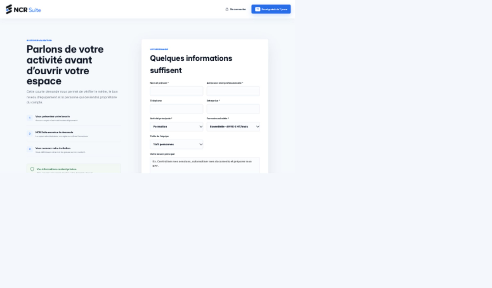

# Phase 1B — Audit visuel ciblé : accès bloqué aux écrans métier

Date : 5 octobre 2026. Branche : `refactor/premium-app-experience`.
Commit applicatif : `63fa0563b51816197b4f6dbbc4de0b5a2a506670`.

## Résultat et portée

**L'application a réellement été lancée et ouverte dans le navigateur. Les cinq écrans métier n'ont pas pu être atteints. Leur audit visuel reste donc non réalisé.** Le présent livrable documente les essais, le blocage observé, les captures de preuve et le contrôle limité de protection de la vitrine. Il ne valide pas la qualité visuelle de l'application authentifiée.

Aucun contournement de permissions, aucune session fabriquée, aucune donnée métier injectée, aucun appel Supabase distant, aucun fichier applicatif modifié. Le bouton de démonstration fourni par l'application a été utilisé normalement ; aucun formulaire de demande d'accès n'a été envoyé.

## 1. Conditions réelles du lancement

- Dépendances absentes initialement. Installation à partir du lockfile avec `npm ci --include=dev --ignore-scripts --no-audit --no-fund`, cache dans `/tmp`. Les premiers essais réseau/port ont été bloqués par le bac à sable, puis autorisés. Aucun changement du package.json ou du lockfile.
- Démarrage du serveur Vite existant : `npm run dev -- --host 127.0.0.1`, port 5173.
- Aucun build : le build existant régénère des CSS applicatives et de vitrine, ce qui sortirait du périmètre.
- Aucun fichier d'environnement Supabase local disponible ; le client `src/lib/supabase.ts` reste nul et l'interface présente le mode de démonstration officiel.
- Navigateur : Codex In-app Browser. Inspection réelle par captures, arbre d'accessibilité, URL finale, mesures DOM et styles calculés en lecture seule.
- Mode développement, et non artefact de production. Service worker non enregistré par main.tsx dans ce mode. Installation PWA, cache hors ligne, notifications et clavier tactile réel non validés.
- Serveur arrêté après contrôle. Les dépendances temporaires ont été déplacées hors dépôt dans `/tmp/ncr-phase1b-dependencies-*` pour ne conserver que la documentation dans les changements locaux.

## 2. Blocage réellement observé

Séquence reproductible dans une origine locale neuve :

1. Ouvrir `http://127.0.0.1:5173/connexion`.
2. L'écran affiche « Mode de démonstration local » et « Ouvrir la démonstration ».
3. Cliquer sur ce bouton.
4. Résultat réellement obtenu : `/demande-acces`, titre « Parlons de votre activité avant d’ouvrir votre espace » ; aucun choix de métier ni dashboard n'est présenté.
5. Les accès directs aux routes connues `/`, `/rendez-vous`, `/planning` et `/commandes` reviennent également à `/demande-acces`.

[Journal des routes](captures-phase-1b/acces-routes.json). Les tableaux `heading` vides de ce journal ont été capturés pendant le rendu transitoire ; ils ne signifient pas que la page finale manque de titre. L'arbre d'accessibilité stabilisé et les captures montrent le formulaire d'accès.

Cause confirmée dans le code : AuthContext.startDemo crée seulement l'identité locale de démonstration. OrganizationContext ne trouve aucune organisation de démonstration existante. ProtectedArea envoie alors vers `/configuration`. EnterpriseOnboardingGuard refuse cette entrée quand `supabase` est nul et redirige vers `/demande-acces` (`service_unavailable`). Ce garde est conservé intact.

Il s'agit d'un **blocage de la démonstration sur installation locale neuve**, pas d'une preuve de panne des comptes de production.

## 3. Résultat par écran demandé

Les deux plannings partagent `/planning` ; le métier de l'organisation sélectionne la page. Sans organisation, ni la variante Sécurité ni la variante Nettoyage ne peut être affichée.

| Écran | Accès tenté / résultat | Éléments déjà réussis à conserver | Défauts réellement constatés sur l'écran métier | Mobile / desktop | Sensation web classique / application premium | Risques et reprise ciblée |
|---|---|---|---|---|---|---|
| Dashboard Formation | `/` → `/demande-acces` | Non évaluables visuellement ; références du code seulement | Aucun constat visuel possible | Non audités à toutes les dimensions | Non évaluable ; aucune recommandation esthétique nouvelle validée | Compte rattaché à une organisation Formation ; préserver contextes, KPI et droits |
| Rendez-vous Beauty | `/rendez-vous` → `/demande-acces` | Non évaluables visuellement | Aucun défaut d'agenda confirmé | Non audités | Non évaluable ; confort tactile à examiner ensuite | Compte Coiffure avec accès RDV ; contexte enseigne/centre et cas de rendez-vous représentatifs |
| Planning Sécurité | `/planning` → `/demande-acces`, aucun contexte Sécurité | Non évaluables visuellement | Aucun défaut du planning confirmé | Non audités | Non évaluable | Organisation Sécurité avec planning accessible ; préserver statuts/actions et restrictions de rôle |
| Planning Nettoyage | `/planning` → `/demande-acces`, aucun contexte Nettoyage | Non évaluables visuellement | Aucun défaut du planning confirmé | Non audités | Non évaluable | Organisation Nettoyage avec planning accessible ; préserver interventions et informations terrain |
| Commandes Restauration | `/commandes` → `/demande-acces` | Non évaluables visuellement | Aucun défaut des commandes confirmé | Non audités | Non évaluable | Organisation Restauration et module commandes ; préserver états, articles et actions de service |

Pour ces cinq écrans, hiérarchie, espace, typographie, contrastes, spacing, alignements, cards, headers, sidebar, bottom bar, boutons, cibles tactiles, formulaires, tableaux, scroll, débordements, sticky/fixed, modales/drawers, états actifs, feedbacks, loaders et états vides restent **non vérifiés visuellement**. Il serait trompeur de compléter leurs sept rubriques par des appréciations tirées uniquement du code.

La connexion locale a néanmoins été vue : identité NCR, CTA de démonstration identifiable, accès aux portails externes. Le parcours qui suit ce CTA ne tient pas la promesse de démonstration et ne fournit pas d'explication visible spécifique au problème local. Ce constat concerne l'accès, pas le design des cinq métiers.

## 4. Beauty — séparation explicite des preuves

| Point demandé | Preuve de phase 1B |
|---|---|
| Agenda et scroll horizontal | Non affichés ; existence du scroll dans le code uniquement |
| Textes 8–10 px | Valeurs repérées en phase 1A ; styles calculés sur de vrais rendez-vous non mesurés |
| DOM injecté / classes du shell | Couplage établi dans le code ; comportement runtime non observé faute d'accès au shell |
| Bottom navigation | Non affichée ; ni stabilité ni recouvrement validés |
| Lisibilité des statuts | Non vérifiée ; aucun rendez-vous rendu |

Les priorités suggérées en phase 1A restent des hypothèses de travail. Ne pas les transformer en défauts visuels confirmés ni supprimer les règles existantes sur cette seule base.

Pour donner une sensation d'application mobile premium, les pistes à tester restent : texte métier lisible, statuts identifiables, actions tactiles accessibles, navigation stable et scroll de semaine maîtrisé. **Ce sont des critères d'acceptation futurs, pas des corrections visuellement démontrées.**

## 5. Protection de la vitrine — vérification effective

La landing locale a été ouverte sur `http://localhost:5173/`, origine distincte de `127.0.0.1` et sans identité de démonstration enregistrée. Cela sert uniquement à afficher la page publique ; aucun contrôle d'accès métier n'a été contourné.

### Observé dans le navigateur

- Le DOM de la landing porte `data-ncr-ui-2026="true"`.
- Les feuilles `ncr-suite-showcase-v2925.css` et `ncr-suite-app-v2925.css?r4-theme` sont toutes deux chargées.
- Les styles de `src/ncrUi2026.css` et des couches Formation/transversales sont présents sur cette même page (balises style Vite).
- Le fond calculé du body est `oklch(0.974 0.006 255)` ; sa police calculée commence par Inter. Ces valeurs correspondent à la règle globale NCR UI 2026 appliquée au body, qui ne se limite pas à `.app-shell`.
- Le hero public a réellement été inspecté en mobile, tablette et desktop : navigation, titre, présentation, cartes illustratives et CTA sont visibles. Aucun débordement horizontal du document mesuré dans les cinq captures stabilisées.

**Conclusion : le partage de styles est réel et vérifié au runtime. Une absence de contamination future ne peut pas être garantie.** Ce constat ne démontre pas une dégradation actuelle de la landing : aucun avant/après n'a été provoqué et aucune règle n'a été désactivée.

### Risques établis dans le code, sans modification

- `src/ncrUi2026.css:159` cible le body global avec typographie/couleurs/fond.
- `src/styles.css` contient des resets et classes génériques utilisés par plusieurs surfaces.
- Le générateur de CSS publiques réutilise styles.css pour l'application et la vitrine ; le build les réécrit.

Protection recommandée pour les futurs lots : privilégier des sélecteurs sous `.app-shell` et des racines propres aux portails ; éviter de changer globalement body, `:root`, `.primary-button`, `.eyebrow` sans vérifier leurs usages publics ; contrôler les fichiers générés ; comparer les captures de landing avant/après aux mêmes dimensions. Ne pas promettre une isolation absolue tant que ces contrôles n'ont pas été faits.

### Dimensions réellement mesurées

Le contrôle de viewport du navigateur était affecté par son facteur d'échelle ; les demandes brutes ne correspondaient pas toujours aux pixels CSS. Les captures de référence ont été calibrées à partir de `innerWidth`/`innerHeight`. Les dimensions ci-dessous sont les mesures effectives, pas les seules valeurs demandées.

| Cible | Largeur × hauteur CSS mesurée | Largeur du document | Capture |
|---|---|---|---|
| Mobile 360 | 360 × 844 | 360 | [360](captures-phase-1b/landing-360-css.jpg) |
| Mobile ~390 | 389 × 844 | 389 | [390](captures-phase-1b/landing-390-css.jpg) |
| Mobile large 430 | 430 × 844 | 430 | [430](captures-phase-1b/landing-430-css.jpg) |
| Tablette ~768 | 767 × 844 | 767 | [768](captures-phase-1b/landing-768-css.jpg) |
| Desktop ~1440 | 1439 × 900 | 1439 | [1440](captures-phase-1b/landing-1440-css.jpg) |

[Mesures brutes](captures-phase-1b/dimensions.json). Les captures de blocage ont leurs propres mesures : 400×843 et 1440×843 ; ne pas appeler la première un test exact à 390 px. Les captures JPEG du navigateur présentent une douceur/redimensionnement : ne pas diagnostiquer la netteté des polices du produit depuis cette seule compression.

Il s'agit de captures du premier viewport, pas d'une inspection exhaustive du scroll de la landing. La vitrine n'a pas été refondue et ses illustrations marketing ne sont pas utilisées comme preuves du dashboard authentifié.

## 6. Classement P0 / P1 / P2

| Priorité | Identifiant | Constat | Niveau de preuve / portée |
|---|---|---|---|
| P0 | — | Aucun bug critique établi sur les écrans métier | Ils n'ont pas pu être inspectés ; cela ne prouve pas l'absence de P0 |
| P1 | VIS-01 | Le CTA de démonstration redirige vers une demande d'accès au lieu d'ouvrir un métier sur installation locale neuve | Reproduit dans le navigateur ; bloque la présente recette locale, sans conclure à une panne de production |
| P1 | ISO-01 | Le socle applicatif s'applique aussi au body de la landing | Couplage runtime confirmé ; risque pour les futures modifications, pas régression visuelle actuelle prouvée |
| P1 à confirmer | CODE-01 | Petites tailles de texte agenda, densité/cibles tactiles et navigation injectée Beauty | Audit de code seulement, aucun classement définitif de défaut visuel |
| P2 | VIS-02 | Le parcours de démonstration ne présente pas de message contextualisé expliquant ce blocage local | Page finale générique observée ; finition de feedback liée à VIS-01 |
| Non classé | — | Défauts visuels particuliers des cinq métiers | Pas de preuves suffisantes pour inventer une sévérité |

## 7. Ce qu'il faut pour achever l'audit des cinq écrans

Une configuration locale du client Supabase et une connexion utilisateur autorisée aux organisations/modules nécessaires, ou un environnement de démonstration déjà provisionné et accessible par le parcours normal. L'accès administratif MCP à la base ne constitue pas une session utilisateur et n'autorise pas à fabriquer un token, rattacher un compte ou élargir ses droits.

Aucune interrogation distante n'a été faite ici : lire les tables ou récupérer une clé publique n'aurait pas suffi à fournir le compte et les contextes métier absents. Aucun mot de passe n'est demandé dans le rapport. Une connexion manuelle dans le navigateur pourra être utilisée lors d'une reprise autorisée.

Ensuite seulement : réexécuter les cinq écrans aux dimensions demandées, inspecter les états riches, les modales et les interactions de navigation, puis distinguer les améliorations importantes des finitions. Pour les actions qui écrivent, utiliser un environnement de test explicitement autorisé ; l'audit visuel seul n'autorise pas une modification de données réelles.

## 8. État final

Documentation et captures uniquement sous `docs/premium-redesign/`. Aucun fichier applicatif ou configuration Git modifié, aucun commit, push ou déploiement. Serveur de test arrêté. Dimensions du navigateur réinitialisées.

**Phase 1B arrêtée avec un blocage documenté. L'inspection des cinq écrans métier reste à compléter ; aucune refonte ne doit être présentée comme fondée sur leur observation visuelle.**
